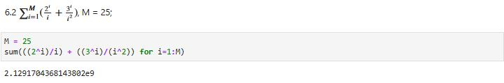

---
## Front matter
lang: ru-RU
title: Структуры данных
author: |
	 Гань Чжаолун\inst{1}

institute: |
	\inst{1}Российский Университет Дружбы Народов

date: 22 ноября, 2024, Москва, Россия

## Formatting
mainfont: PT Serif
romanfont: PT Serif
sansfont: PT Sans
monofont: PT Mono
toc: false
slide_level: 2
theme: metropolis
header-includes: 
 - \metroset{progressbar=frametitle,sectionpage=progressbar,numbering=fraction}
 - '\makeatletter'
 - '\beamer@ignorenonframefalse'
 - '\makeatother'
aspectratio: 43
section-titles: true

---

# Цели и задачи работы

Изучение структур данных, реализованных в Julia. Научиться применять их и операции над ними для решения задач.

# Цель лабораторной работы

## Используя Jupyter Lab, повторите примеры из раздела 2.2.

Я повторю все задание 2.2 целиком

## Задания для самостоятельного выполнения

Рисунок 1. Код и результат Задания 1

Рисунок 2. Примеры операций над множествами разных типов

Рисунок 3. Код и результат Задания 3.1

Рисунок 4. Код и результат Задания 3.2

Рисунок 5. Код и результат Задания 3.3

Рисунок 6. Код и результат Задания 3.4

Рисунок 7. Код и результат Задания 3.5

Рисунок 8. Код и результат Задания 3.6

Рисунок 9. Код и результат Задания 3.7

Рисунок 10. Код и результат Задания 3.8

Рисунок 11. Код и результат Задания 3.9

Рисунок 12. Код и результат Задания 3.10

Рисунок 13. Код и результат Задания 3.11

Рисунок 14. Код и результат Задания 3.12

Рисунок 15. Код и результат Задания 3.13

Рисунок 16. Код и результат Задания 3.14

Рисунок 17. Код и результат Задания 3.14-1

Рисунок 18. Код и результат Задания 3.14-2

Рисунок 19. Код и результат Задания 3.14-3

Рисунок 20. Код и результат Задания 3.14-4

Рисунок 21. Код и результат Задания 3.14-5

Рисунок 22. Код и результат Задания 3.14-6

Рисунок 23. Код и результат Задания 3.14-7

Рисунок 24. Код и результат Задания 3.14-8

Рисунок 25. Код и результат Задания 3.14-9

Рисунок 26. Код и результат Задания 3.14-10

Рисунок 27. Код и результат Задания 3.14-11

Рисунок 28. Код и результат Задания 3.14-12

Рисунок 29. Код и результат Задания 3.14-13

Рисунок 30. Код и результат Задания 4

Рисунок 31. Код и результат Задания 5

Рисунок 32. Код и результат Задания 6

# Вывод
Изучила структуры данных, реализованных в Julia. Научилась применять их и операции над ними для решения задач.

