# Отчёт по лабораторной работе №2
### Структуры данных
## Гань Чжаолун

# Цель работы

Изучение структур данных, реализованных в Julia. Научиться применять их и операции над ними для решения задач.

# Выполнение лабораторной работы

### 2.2.1 Кортежи
Кортеж (Tuple) — структура данных (контейнер) в виде неизменяемой индексируемой последовательности элементов какого-либо типа (элементы индексируются с единицы).
Синтаксис определения кортежа: (element1, element2, ...)

Рисунок 1. Примеры создания кортежей

Рисунок 2. Примеры операций над кортежами
### 2.2.2 Словари
Словарь — неупорядоченный набор связанных между собой по ключу данных. 
Синтаксис определения словаря: Dict(key1 => value1, key2 => value2, ...)

Рисунок 3. Примеры инициализации и операций над словарями

Рисунок 4. Объединение словарей
### 2.2.3 Множества
Множество, как структура данных в Julia, соответствует множеству, как математическому объекту, то есть является неупорядоченной совокупностью элементов какого-либо типа. 
Возможные операции над множествами: объединение, пересечение, разность; принадлежность элемента множеству. 
Синтаксис определения множества: Set([itr]), где itr — набор значений, сгенерированных данным итерируемым объектом или пустое множество.

Рисунок 5. Примеры множеств и операций над ними (Часть 1)

Рисунок 6. Примеры множеств и операций над ними (Часть 2)
### 2.2.4 Массивы
Массив — коллекция упорядоченных элементов, размещённая в многомерной сетке. Векторы и матрицы являются частными случаями массивов. 
Общий синтаксис одномерных массивов: 
oarray_name_1 = [element1, element2, ...] 
oarray_name_2 = [element1 element2 ...]

Рисунок 7. Пример объявления массивов (1)

Рисунок 8. Пример объявления массивов (2)

Рисунок 9. Пример объявления массивов (3)

Рисунок 10. Пример объявления массивов (4)

Примеры операций над массивами.

### Задания для самостоятельного выполнения

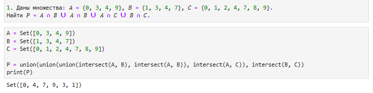

Рисунок 11. Код и результат Задания 1

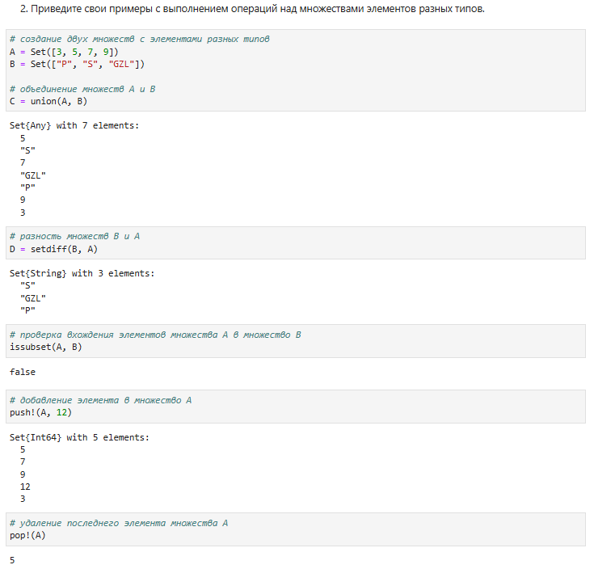

Рисунок 12. Примеры операций над множествами разных типов

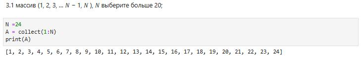

Рисунок 13. Код и результат Задания 3.1

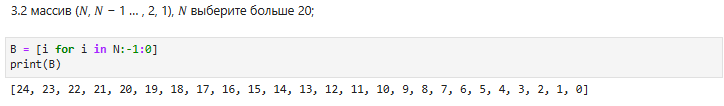

Рисунок 14. Код и результат Задания 3.2

Рисунок 15. Код и результат Задания 3.3

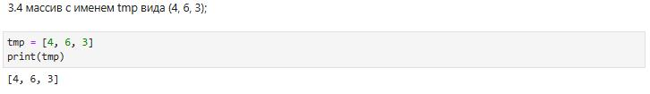

Рисунок 16. Код и результат Задания 3.4

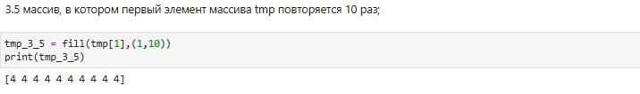

Рисунок 17. Код и результат Задания 3.5

Рисунок 18. Код и результат Задания 3.6

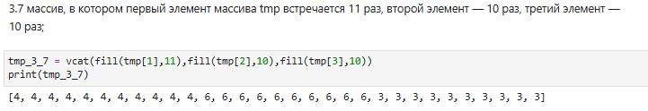

Рисунок 19. Код и результат Задания 3.7

Рисунок 20. Код и результат Задания 3.8

Рисунок 21. Код и результат Задания 3.9

Рисунок 22. Код и результат Задания 3.10

Рисунок 23. Код и результат Задания 3.11

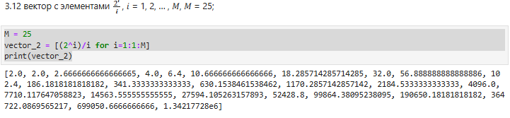

Рисунок 24. Код и результат Задания 3.12

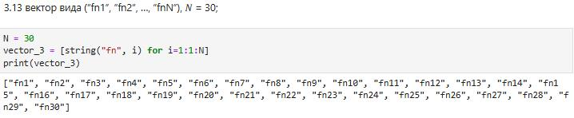

Рисунок 25. Код и результат Задания 3.13

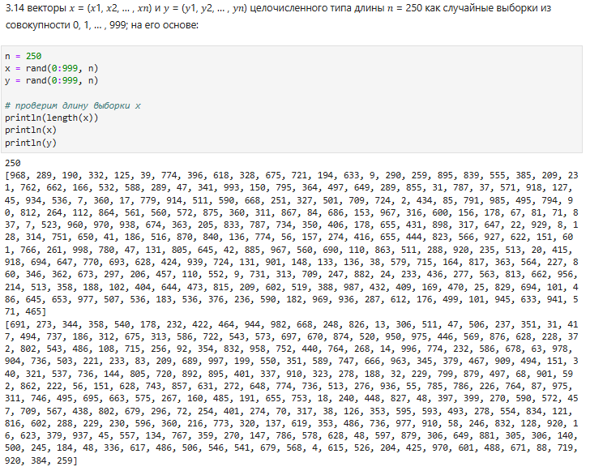

Рисунок 26. Код и результат Задания 3.14

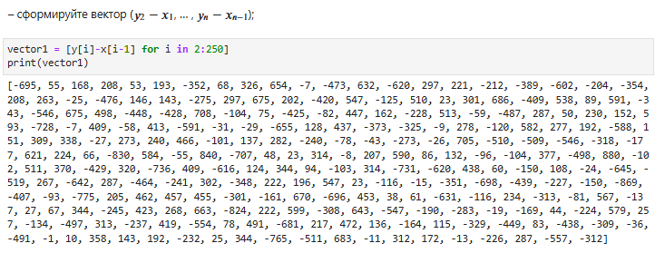

Рисунок 27. Код и результат Задания 3.14-1

Рисунок 28. Код и результат Задания 3.14-2

Рисунок 29. Код и результат Задания 3.14-3

Рисунок 30. Код и результат Задания 3.14-4

Рисунок 31. Код и результат Задания 3.14-5

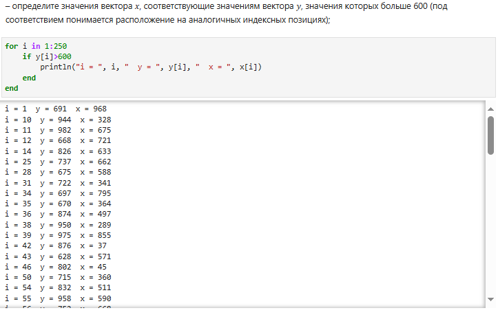

Рисунок 32. Код и результат Задания 3.14-6

Рисунок 33. Код и результат Задания 3.14-7

Рисунок 34. Код и результат Задания 3.14-8

Рисунок 35. Код и результат Задания 3.14-9

Рисунок 36. Код и результат Задания 3.14-10

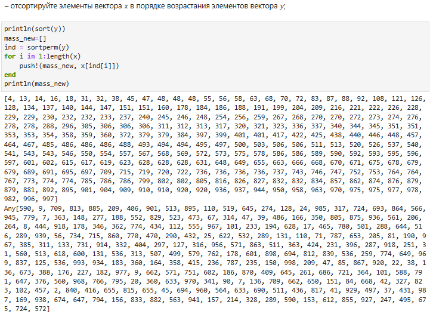

Рисунок 37. Код и результат Задания 3.14-11

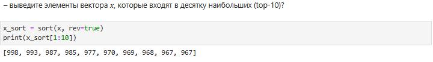

Рисунок 38. Код и результат Задания 3.14-12

Рисунок 39. Код и результат Задания 3.14-13

Рисунок 40. Код и результат Задания 4

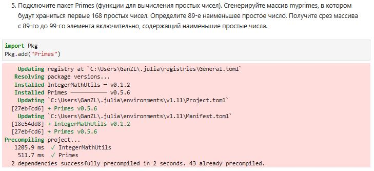

Рисунок 41. Код и результат Задания 5-1

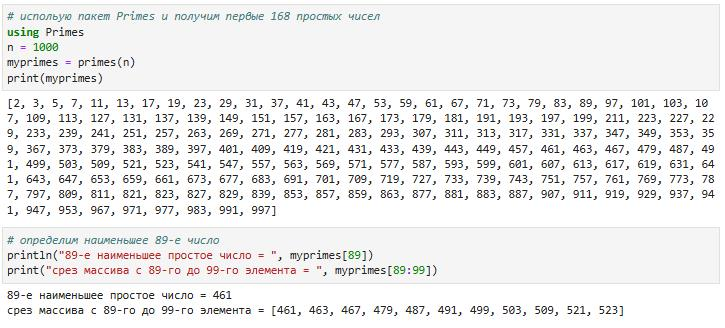

Рисунок 42. Код и результат Задания 5-2

Рисунок 43. Код и результат Задания 6-1

Рисунок 44. Код и результат Задания 6-2

Рисунок 45. Код и результат Задания 6-3

# Вывод
Изучила структуры данных, реализованных в Julia. Научилась применять их и операции над ними для решения задач.

