# Отчёт по лабораторной работе №3
### Управляющие структуры
## Гань Чжаолун

# Цель работы

Основная цель работы — освоить применение циклов, функций и сторонних для Julia пакетов для решения задач линейной алгебры и работы с матрицами.

# Выполнение лабораторной работы

### Циклы while и for

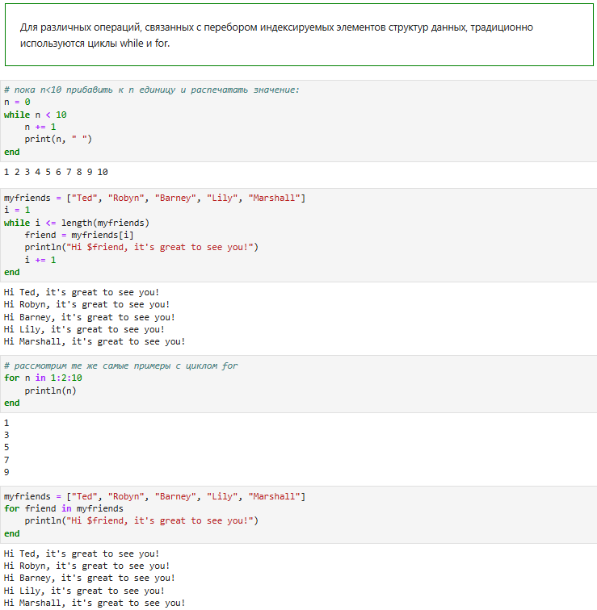

Рисунок 1. Циклы while и for -1

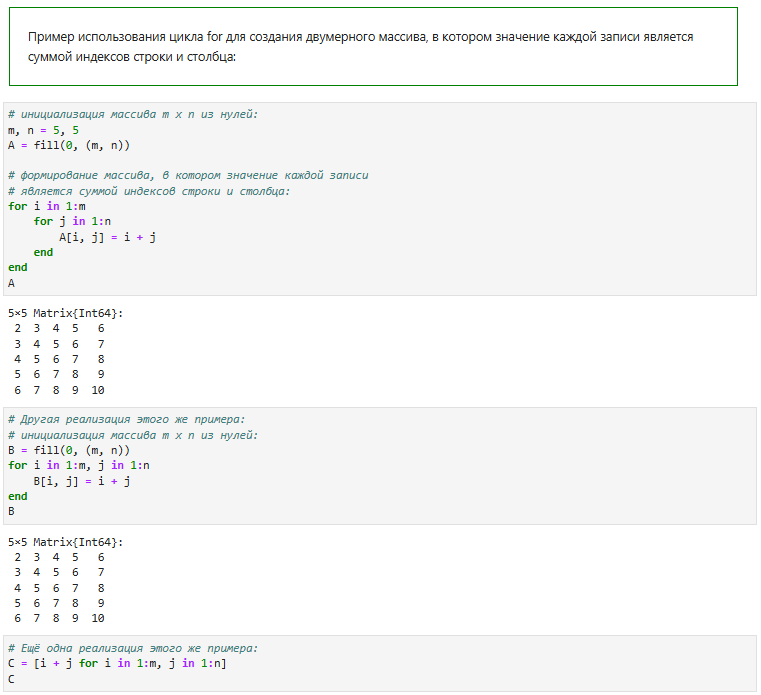

Рисунок 2. Циклы while и for -2

### Условные выражения
- Довольно часто при решении задач требуется проверить выполнение тех или иных условий. Для этого используют условные выражения

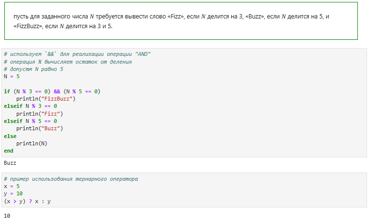

Рисунок 3. Условные выражения

### Функции
- Julia дает нам несколько разных способов написать функцию. Первый требует ключевых слов function и end.

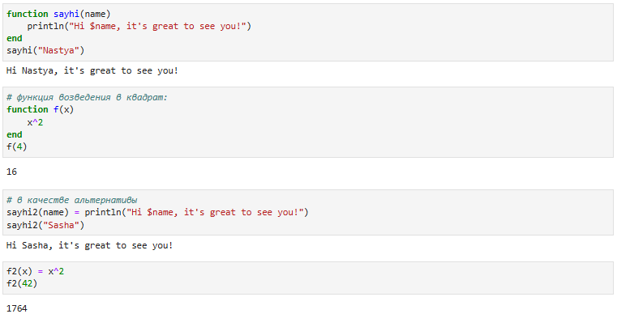

Рисунок 4. Функции

### Также можно объявить вышеперечисленные функции как анонимные

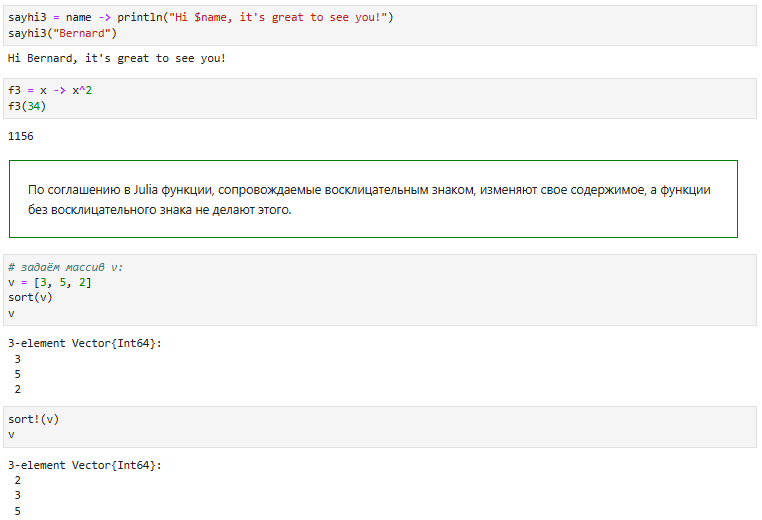

Рисунок 5. объявить функции как анонимные -1

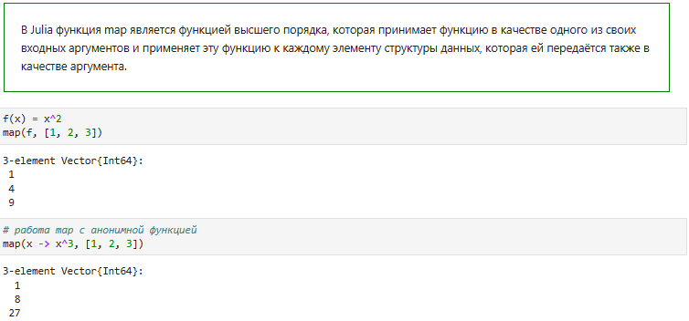

Рисунок 6. объявить функции как анонимные -2

Рисунок 7. объявить функции как анонимные -3

### Сторонние библиотеки в Julia

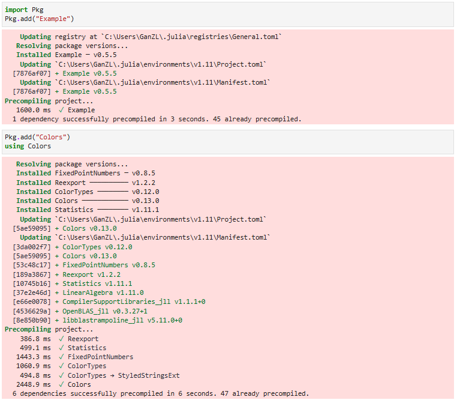

Рисунок 8. Сторонние библиотеки в Julia -1

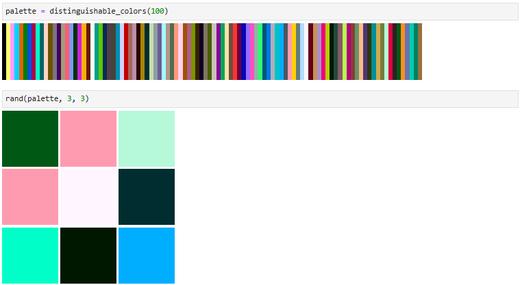

Рисунок 9. Сторонние библиотеки в Julia -2

_______________

### Задания для самостоятельного выполнения

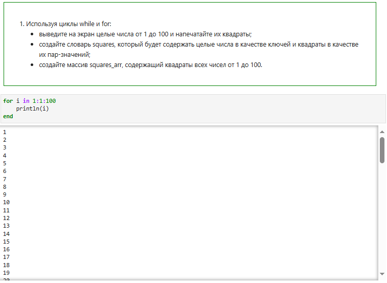

Рисунок 10. Код и результат Задания 1-1

Сначала я вывел числа от 1 до 100, применив цикл `for`. Это позволило последовательно пройти все значения от 1 до 100 и напечатать их, что является простым и эффективным способом организации итераций по фиксированному диапазону.

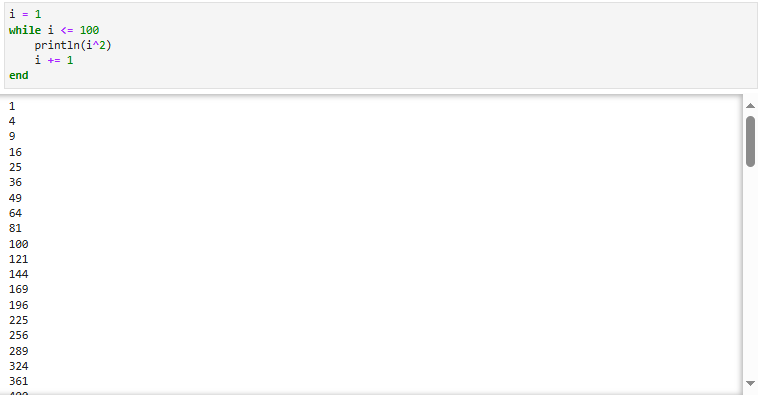

Рисунок 11. Код и результат Задания 1-2

Затем с помощью цикла `while` я вывел квадраты всех чисел от 1 до 100. Цикл `while` позволил мне возводить числа в квадрат, пока условие (`i <= 100`) выполнялось. В результате, были напечатаны квадраты всех чисел от 1 до 100.

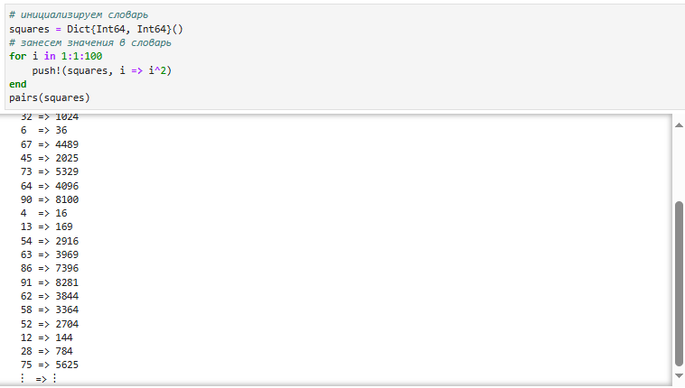

Рисунок 12. Код и результат Задания 1-3

Я создал словарь `squares`, используя цикл `for`, чтобы добавить в словарь числа в качестве ключей и их квадраты как значения. В итоге словарь `squares` содержал все числа от 1 до 100 и соответствующие им квадраты, что позволило иметь прямую связь между числом и его квадратом для дальнейшего использования.

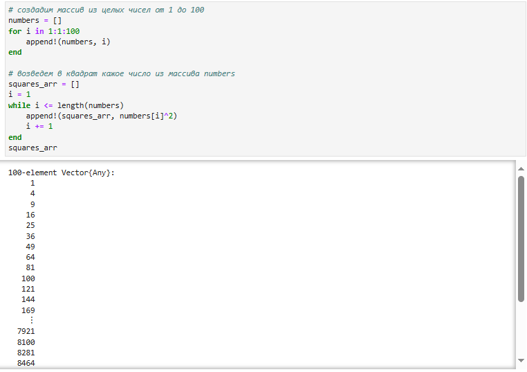

Рисунок 13. Код и результат Задания 1-4

Наконец, я создал массив `squares_arr`, содержащий квадраты чисел от 1 до 100. Сначала я инициализировал массив чисел от 1 до 100, а затем с помощью цикла `while` возводил каждое число в квадрат и добавлял в новый массив `squares_arr`. В результате массив `squares_arr` включал все квадраты чисел, что упрощает доступ к ним при необходимости.

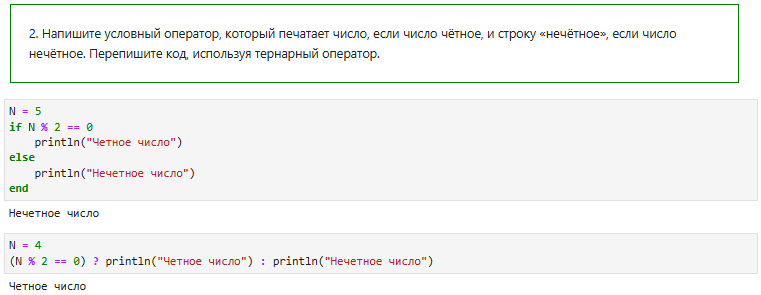

Рисунок 14. Код и результат Задания 2

В первом шаге я написал условный оператор `if-else` для проверки четности числа. 
Здесь я проверяю, делится ли число `N` на 2 без остатка. Если остаток равен нулю (`N % 2 == 0`), то программа выводит `"Четное число"`, иначе — `"Нечетное число"`.

На втором шаге я переписал тот же условный оператор, используя тернарный оператор,
Тернарный оператор в Julia имеет следующую структуру: `(условие) ? значение_если_истинно : значение_если_ложно`. Здесь я проверяю, является ли число `N` четным, и в зависимости от результата либо вывожу `"Четное число"`, либо `"Нечетное число"`.

Рисунок 15. Код и результат Задания 3

- Я определил функцию `add_one`, которая принимает один аргумент `X`.

- В теле функции я добавил `1` к значению `X` и возвращаю результат. Поскольку Julia автоматически возвращает последнее вычисленное выражение в функции, явное использование `return` не требуется.
 
- Я вызвал функцию `add_one(5)`, чтобы протестировать ее работу. В данном случае значение `5` передается в функцию как аргумент `X`.

- Вызов функции `add_one(5)` возвращает значение `6`, так как к аргументу `5` добавляется `1`. 

Рисунок 16. Код и результат Задания 4

- `X = fill(1, 4 * 4)`: Я создал одномерный массив из 16 элементов, каждый из которых равен `1`. 
   
- `Y = collect(0:(length(X) - 1))`: Я создал массив `Y`, который содержит значения от `0` до `15`. Эти значения будут добавляться к каждому элементу матрицы `X`, чтобы получить последовательность, увеличивающуюся на единицу с каждым шагом.
 
- `X = reshape(..., (4, 4))`: Я преобразовал полученный одномерный массив в матрицу размером `4x4`. В итоге получена матрица размером `4x4`, в которой каждый элемент увеличивается на единицу по сравнению с предыдущим.

Рисунок 17. Код и результат Задания 5

- создал матрицу `A` размером `3x3`, используя синтаксис в Julia: `A = [1 1 3; 5 2 6; -2 -1 -3]`.
 
- применил оператор `^` для возведения матрицы в степень 3 (`A^3`), что означает умножение матрицы на саму себя трижды. 

- заменил третий столбец матрицы `A` на сумму второго и третьего столбцов с использованием цикла `for`:
   - В цикле `for i in 7:1:9` я перебираю индексы элементов третьего столбца, начиная с 7-го элемента и заканчивая 9-м.
   - Каждому элементу третьего столбца (`A[i]`) я добавляю соответствующий элемент второго столбца (`A[i-3]`), чтобы получить нужный результат.

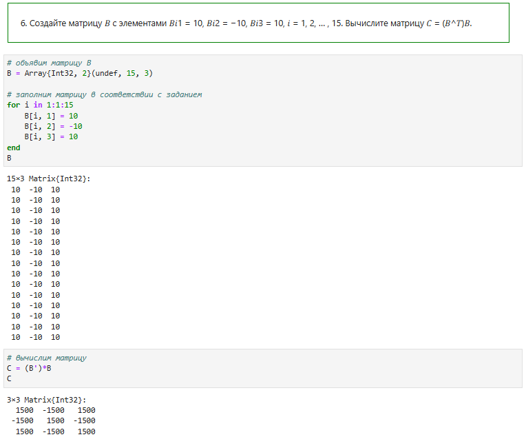

Рисунок 18. Код и результат Задания 6

- Я объявил матрицу `B` размером `15x3` с использованием `Array{Int32, 2}(undef, 15, 3)`, что означает создание двумерного массива типа `Int32` с размерами `15` строк и `3` столбца.

	Использование `undef` позволяет сначала выделить память для массива, а затем заполнить его необходимыми значениями.

- Я использовал цикл `for i in 1:1:15` для перебора всех строк матрицы.

	Заполнил все элементы в каждой строке значениями: `10`, `-10` и `10` для первого, второго и третьего столбцов соответственно.
 
- Я вычислил матрицу `C` как произведение транспонированной матрицы `B` и самой матрицы `B`: `C = (B') * B`.

	Здесь `B'` обозначает транспонирование матрицы `B`, а затем выполняется матричное умножение.

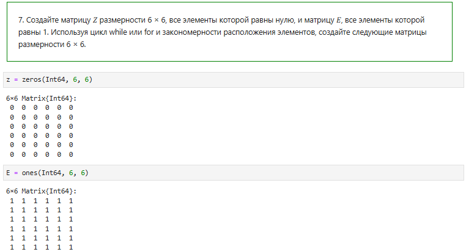

Рисунок 19. Код и результат Задания 7-1

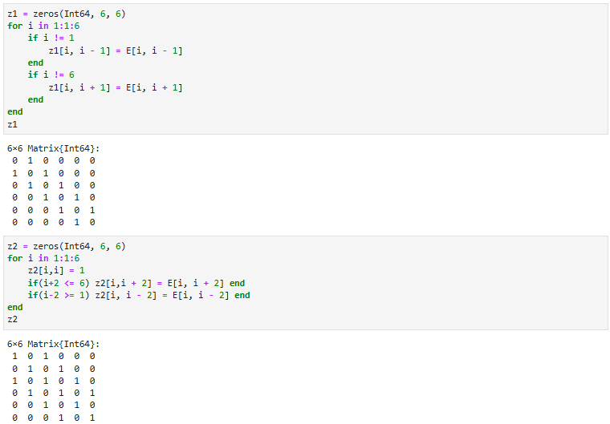

Рисунок 20. Код и результат Задания 7-2

- z1: Создана с элементами равными `1`, расположенными по соседству с главной диагональю. Цикл добавляет единицы в элементы, которые находятся рядом с главной диагональю.
   
- z2: Создана с элементами главной диагонали равными `1`, а также с добавлением единиц через две позиции от главной диагонали.

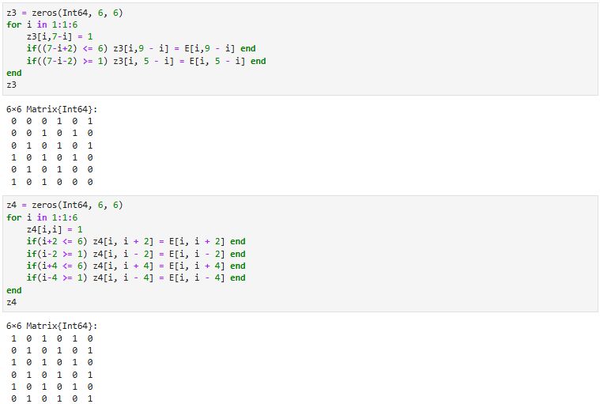

Рисунок 21. Код и результат Задания 7-3

- z3: Создана с зеркальным отражением элементов относительно главной диагонали и с дополнительными значениями, отстоящими на две позиции.
 
- z4: Создана с элементами главной диагонали, а также с добавлением единиц через две и четыре позиции от диагонали. Это обеспечивает равномерное распределение `1` вдоль диагонали и по сторонам.

Рисунок 22. Код и результат Задания 8-1

1. Создание функции `outer`:
   - Функция `outer` принимает три аргумента: `x`, `y`, и `operation`.
   - Сначала проверяется, являются ли входные данные векторами (`ndims(x) == 1`). Если это так, то вектора преобразуются в матрицы с использованием функции `reshape`.
   - Создается пустая результирующая матрица `c` размером `(size(x)[1], size(y)[2])`, которая будет содержать результаты.
   - Далее используется вложенный цикл `for`, который проходит по всем элементам и выполняет операцию, переданную в аргументе `operation`.
 
2. Проверка работы функции:
   - В качестве проверки, я использовал функцию `outer` для произведения матрицы `X` самой на себя и убедился, что результат эквивалентен обычному матричному умножению (`X * X`).

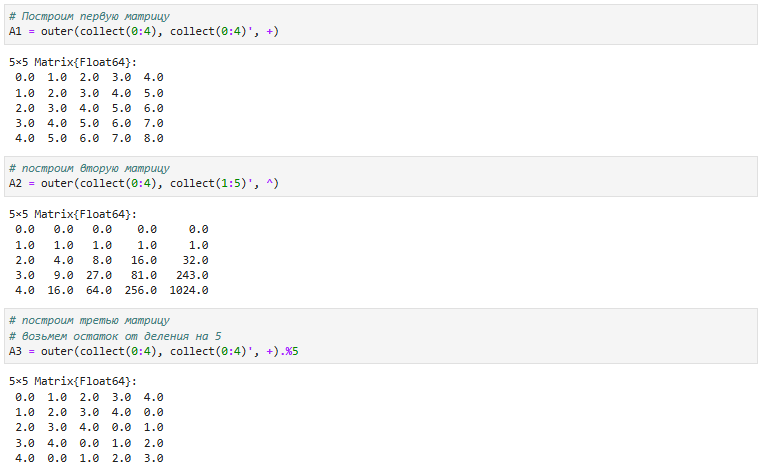

Рисунок 23. Код и результат Задания 8-2

- A1: Матрица, созданная на основе векторов `0:4` и операции сложения. Эта операция фактически создает таблицу сложения для чисел от 0 до 4.
- A2: Матрица, созданная с использованием возведения в степень для элементов векторов `0:4` и `1:5`.
- A3: Сложение элементов с последующим взятием остатка от деления на `5`. Это создает матрицу, где значения периодически повторяются с шагом `5`.

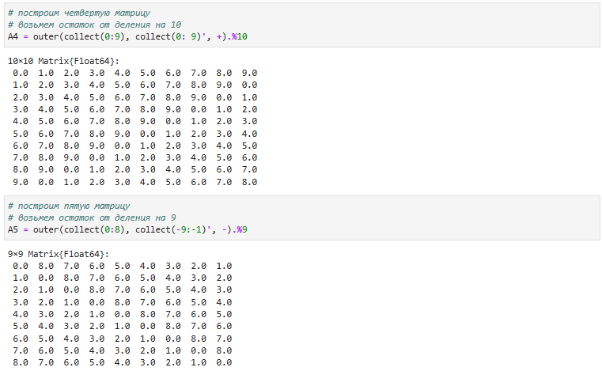

Рисунок 24. Код и результат Задания 8-3

- A4: Матрица размером `10x10`, элементы которой — это сумма чисел с последующим взятием остатка от деления на `10`.
- A5: Используется операция вычитания, затем берется остаток от деления на `9` между значениями из диапазонов `0:8` и `-9:-1`.

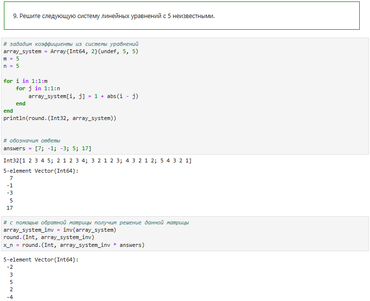

Рисунок 25. Код и результат Задания 9

1. Задание коэффициентов матрицы `A`:
   - Я задал матрицу `array_system` размером `5x5`, используя цикл `for`. Каждый элемент `A[i, j]` был вычислен как `1 + abs(i - j)`, что создает матрицу со специфической симметричной структурой.
   - Использование цикла позволяет легко обобщить решение на матрицы большей размерности (например, `nxn`), сохраняя ту же закономерность при формировании элементов.
 
2. Задание вектора ответов:
   - Вектор ответов (`answers`) представляет собой значения правой части системы уравнений: `[7, -1, -3, 5, 17]`.
 
3. Решение системы с помощью обратной матрицы:
   - Я вычислил обратную матрицу `array_system_inv` с помощью функции `inv()`.
   - Далее для нахождения решения `x` я умножил обратную матрицу на вектор ответов (`x_n = array_system_inv * answers`).
   - Значения были округлены с использованием функции `round.(Int, ...)`, чтобы получить целые числа в результате.

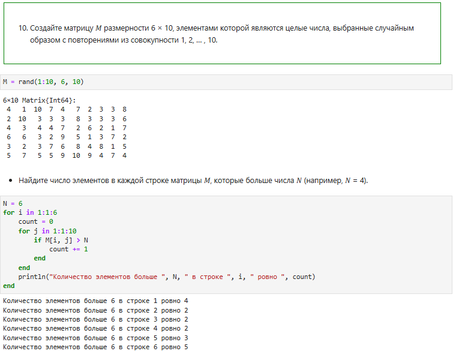

Рисунок 26. Код и результат Задания 10-1

1. Создание матрицы `M`:
   - Я создал матрицу `M` размером `6x10`, заполненную случайными целыми числами от `1` до `10`, используя функцию `rand(1:10, 6, 10)`.
 
2. Определение количества элементов больше `N` в каждой строке:
   - Использовал цикл `for`, чтобы пройти по каждой строке матрицы и посчитать количество элементов, которые больше заданного числа `N` (в данном случае `N = 6`).
   - Результат выводится для каждой строки, показывая количество элементов, которые превышают `N`.

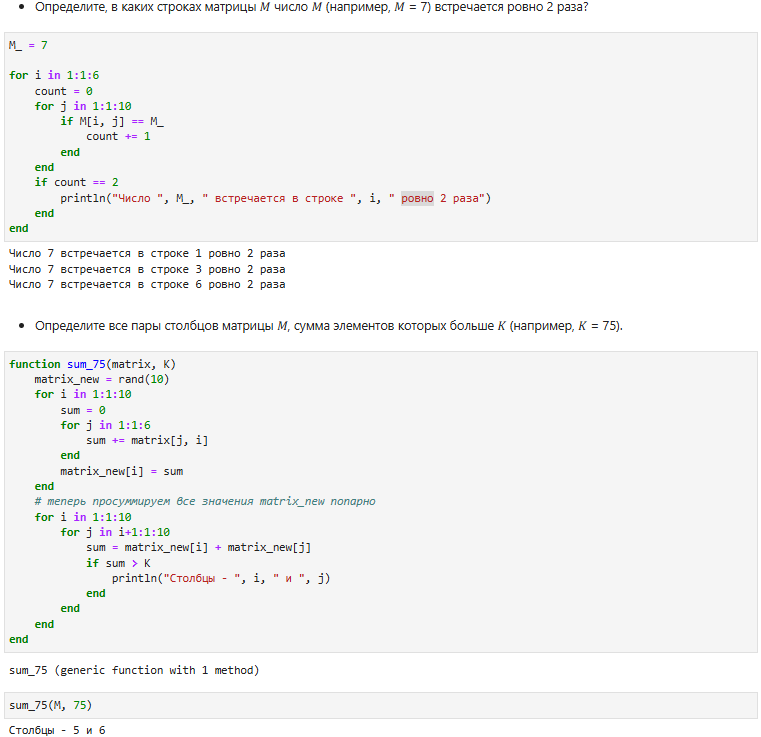

Рисунок 27. Код и результат Задания 10-2

3. Определение строк, где число `M_` встречается ровно два раза:
   - В следующем цикле я посчитал, сколько раз число `M_` (в данном случае `M_ = 7`) встречается в каждой строке матрицы `M`.
   - Если число `7` встречается ровно два раза, выводится номер этой строки.
 
4. Определение пар столбцов, сумма элементов которых больше `K`:
   - Я создал функцию `sum_75(matrix, K)`, которая сначала вычисляет сумму элементов каждого столбца матрицы.
   - Затем эти суммы попарно суммируются, и проверяется, превышает ли эта сумма заданное значение `K` (в данном случае `K = 75`).
   - Выводятся все пары столбцов, сумма которых больше `K`.

Рисунок 28. Код и результат Задания 11

1. Первая сумма:
   - Я использовал два вложенных цикла для вычисления этой суммы.
   - Внешний цикл проходит по значениям `i` от `1` до `20`, а внутренний — по значениям `j` от `1` до `5`.
   - Для каждой комбинации `i` и `j` вычисляется дробь `(i^4) / (3 + j)` и добавляется к переменной `first_sum`.
 
2. Вторая сумма:
   - Аналогично первой сумме, я использовал вложенные циклы для вычисления.
   - Для каждой комбинации `i` и `j` я вычисляю дробь `(i^4) / (3 + i * j)` и добавляю к переменной `second_sum`.

# Вывод
Освоил  применение  циклов,  функций  и  сторонних  для  Julia  пакетов  для решения задач линейной алгебры и работы с матрицами.

