# Отчёт по лабораторной работе №4
### Линейная алгебра
## Гань Чжаолун

# Цель работы

Основной целью работы является изучение возможностей специализированных пакетов Julia для выполнения и оценки эффективности операций над объектами линейной алгебры.

# Выполнение лабораторной работы

### 4.2.1. Поэлементные операции над многомерными массивами

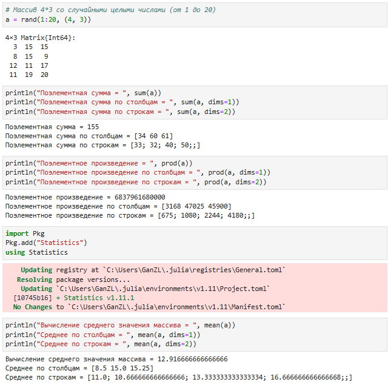

Рисунок 0.1. Поэлементные операции над многомерными массивами

### 4.2.2. Транспонирование, след, ранг, определитель и инверсия матрицы

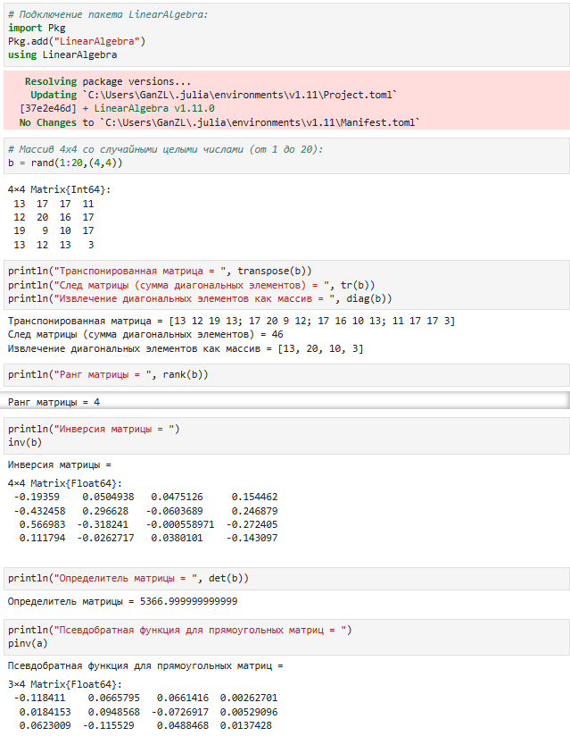

Рисунок 0.2. Транспонирование, след, ранг, определитель и инверсия матрицы

### 4.2.3. Вычисление нормы векторов и матриц, повороты, вращения

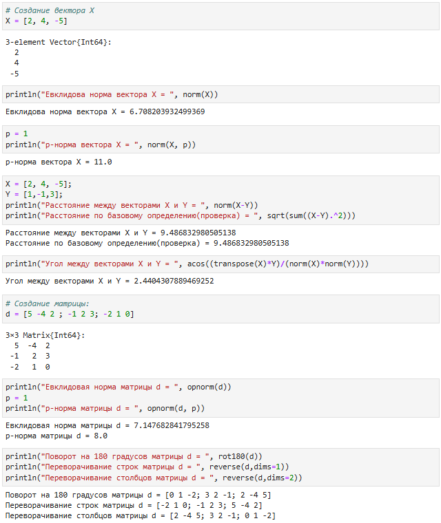

Рисунок 0.3. Вычисление нормы векторов и матриц, повороты, вращения

### 4.2.4. Матричное умножение, единичная матрица, скалярное произведение

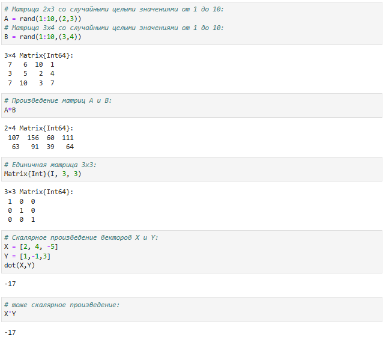

Рисунок 0.4. Матричное умножение, единичная матрица, скалярное произведение

### 4.2.5. Факторизация. Специальные матричные структуры

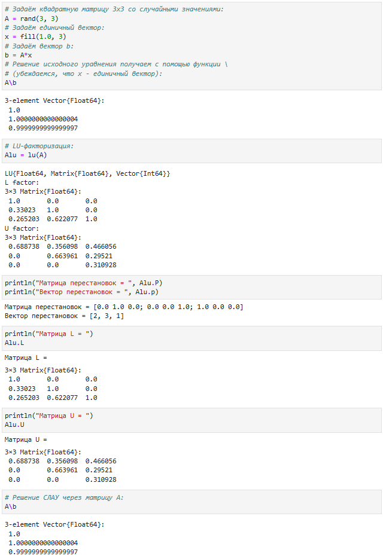
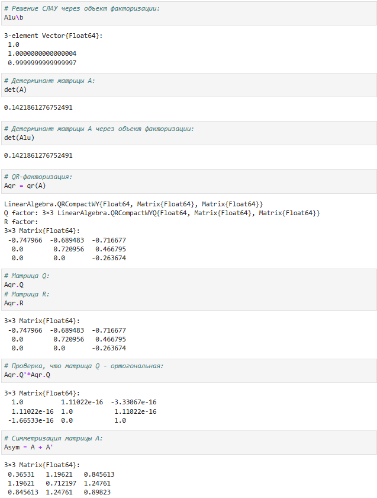
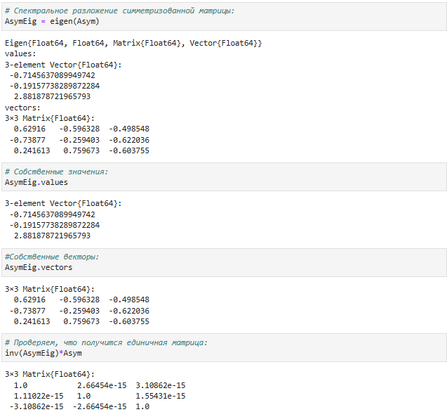
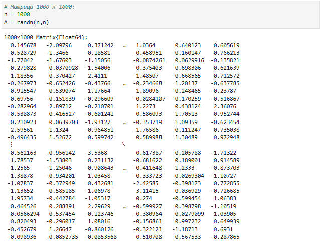
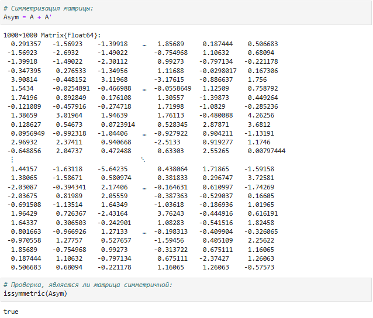
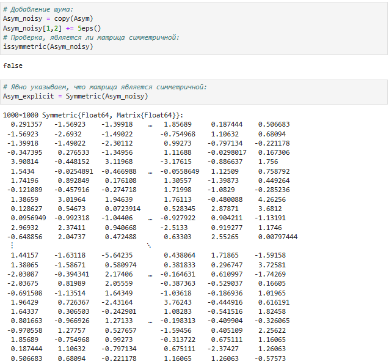
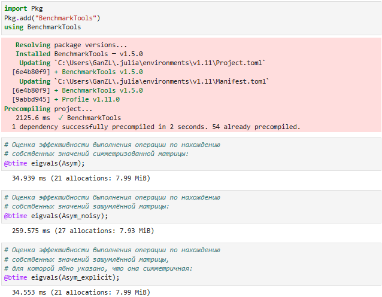
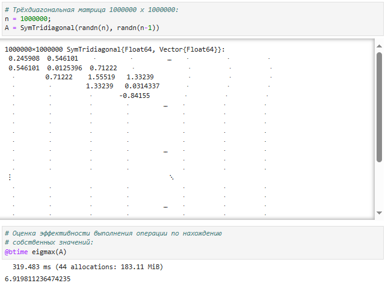

Рисунок 0.5.1-0.5.8 Факторизация. Специальные матричные структуры

### 4.2.6. Общая линейная алгебра

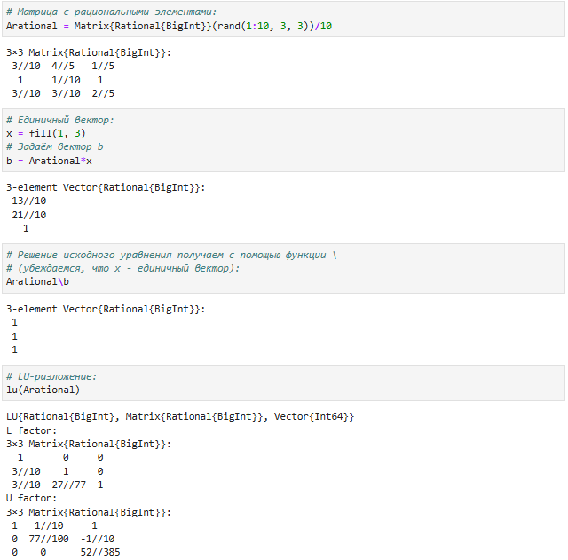

Рисунок 0.6. Общая линейная алгебра

### Задания для самостоятельного выполнения

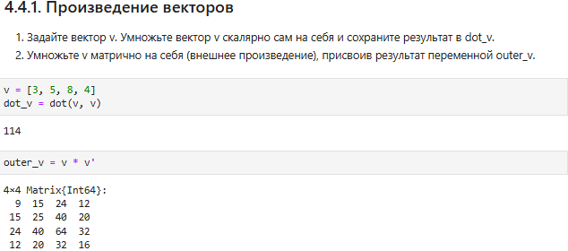

Рисунок 1.1. Код и результат Задания 1

1.Скалярное произведение (dot_v): Результатом является скаляр, который вычисляется как сумма произведений соответствующих элементов вектора на самих себя. В данном случае результат равен 114.

2.Внешнее произведение (outer_v): Результатом является матрица 4x4, каждый элемент которой представляет собой произведение соответствующих элементов вектора. Полученная матрица является симметричной.

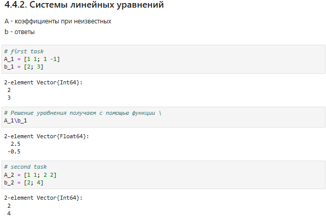
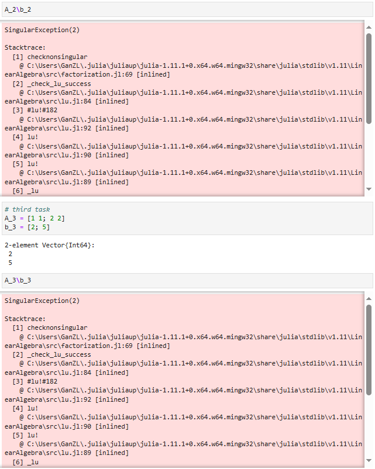
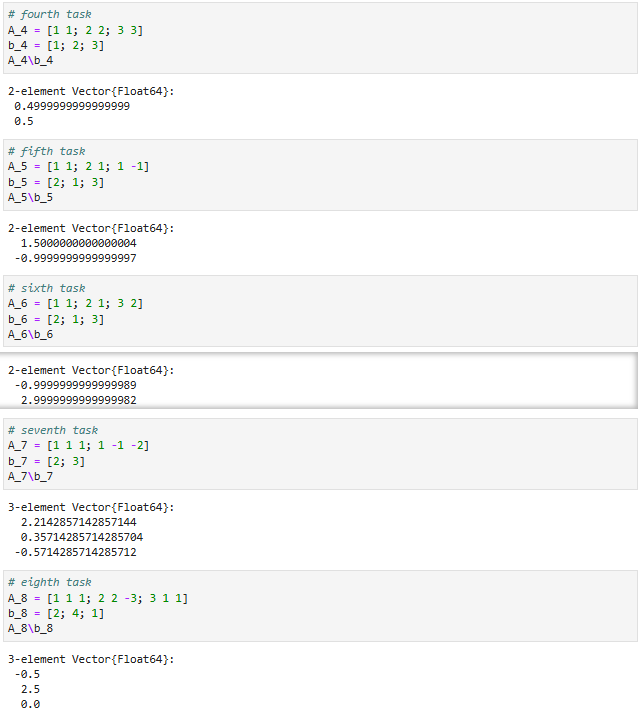
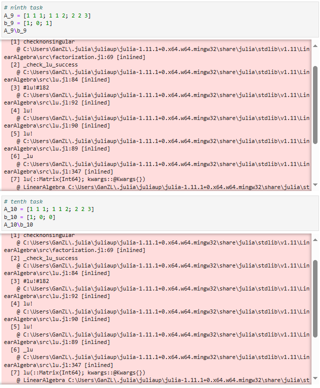

Рисунок 1.2.1-1.2.4. Код и результат Задания 2

1.Представление СЛАУ в матричной форме: СЛАУ с двумя или несколькими неизвестными можно записать в матричной форме, где матрица коэффициентов переменных (A) умножается на вектор неизвестных (x), что дает вектор значений правой части (b):

𝐴∗𝑥=𝑏

Здесь A — это матрица коэффициентов, а b — вектор правых частей.

2.Решение через оператор "левого деления" (\): В Julia для решения линейных уравнений используется оператор \, который находит вектор неизвестных x:

x = A \ b

Этот оператор находит решение, используя методы линейной алгебры, такие как метод Гаусса или LU-разложение.

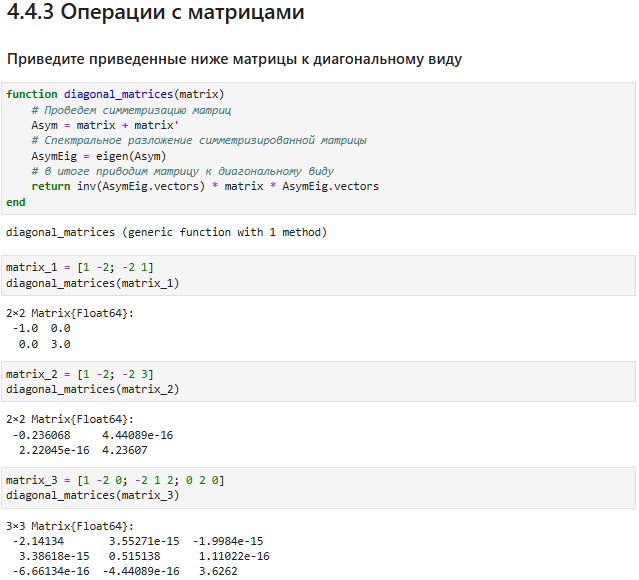

Рисунок 1.3.1 Код и результат Задания 1

1.Симметризация: Первым шагом симметризуем матрицу, чтобы работать с более удобной в вычислениях версией, так как симметричные матрицы имеют вещественные собственные значения.

2.Спектральное разложение: Вычисляем собственные значения и векторы симметризованной матрицы, что позволяет привести исходную матрицу к диагональному виду.

3.Диагонализация: Используем собственные векторы для преобразования матрицы в диагональный вид, что упрощает ее дальнейший анализ и вычисления.

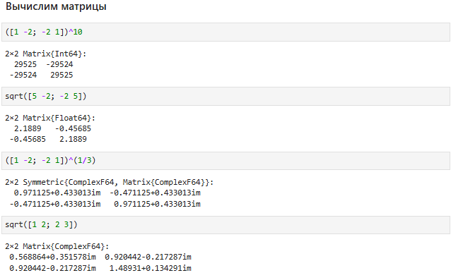

Рисунок 1.3.2 Код и результат Задания 1

1.Возведение матрицы в степень: Использую оператор ^, чтобы возвести матрицу в нужную степень. Это полезно, когда необходимо работать с многократными линейными преобразованиями.

2.Извлечение корня: Применяю функцию sqrt() для извлечения квадратного корня из матрицы, что работает с симметричными положительно определёнными матрицами. Для кубического корня применяю возведение в степень 1/3.

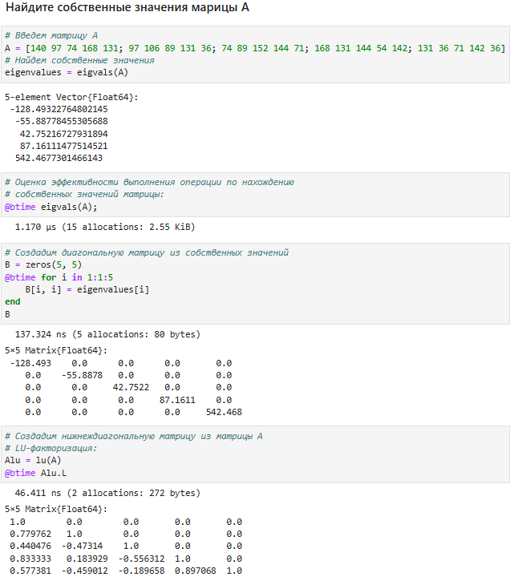

Рисунок 1.3.3 Код и результат Задания 1

1.Собственные значения: Для нахождения собственных значений использую eigvals(). Это важный шаг для анализа структуры матрицы и её свойств.

2.Диагональная матрица: Создаю диагональную матрицу из собственных значений, чтобы легко анализировать свойства матрицы в диагонализованной форме.

3.Нижняя треугольная матрица: Использую LU-разложение для выделения нижней треугольной матрицы. Этот метод удобен для анализа, поскольку LU-разложение разбивает матрицу на произведение двух треугольных матриц, что упрощает дальнейшие вычисления.

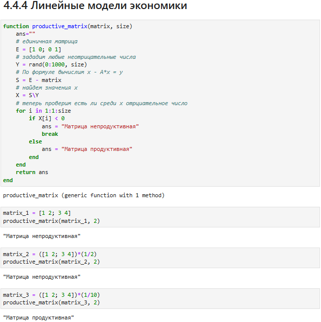

Рисунок 1.4.1 Код и результат Задания 1

1.Проверка продуктивности через систему уравнений: Сначала формирую матрицу вида E - A и решаю систему линейных уравнений с случайной неотрицательной правой частью. Если среди элементов решения есть отрицательные, матрица считается непродуктивной.

2.Обратная матрица для анализа знаков: Также использую метод нахождения обратной матрицы E - A и анализирую все её элементы на наличие отрицательных значений. Отрицательные элементы свидетельствуют о непродуктивности матрицы.

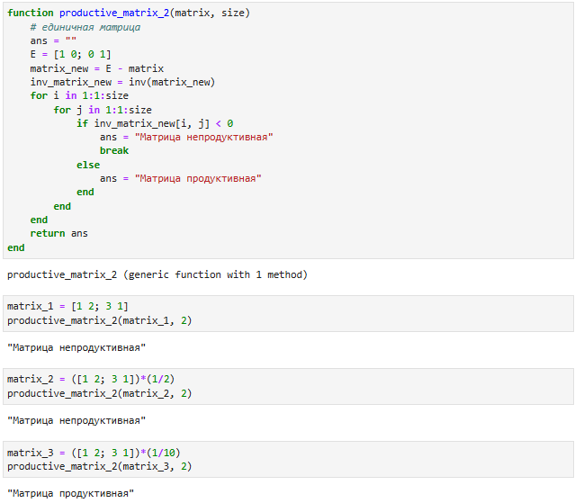

Рисунок 1.4.2 Код и результат Задания 1

1.Формирование обратной матрицы: Сначала вычисляю обратную матрицу для (E - A). Продуктивность матрицы A определяется тем, что все элементы обратной матрицы должны быть неотрицательными.

2.Проверка на неотрицательность: Анализирую все элементы обратной матрицы. Если среди них встречаются отрицательные значения, матрица считается непродуктивной. Если все элементы неотрицательные, то матрица является продуктивной.

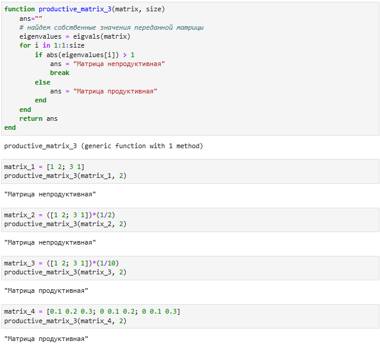

Рисунок 1.4.3 Код и результат Задания 1

1.Спектральный критерий: Сначала нахожу собственные значения матрицы. Продуктивность матрицы A определяется тем, что все её собственные значения по модулю должны быть меньше 1.

2.Проверка собственных значений: Анализирую модуль каждого собственного значения. Если хотя бы одно значение больше или равно 1, то матрица считается непродуктивной. Если все значения меньше 1, то матрица продуктивная.

# Вывод

Я изучил возможности специализированных пакетов Julia для выполнения и оценки эффективности операций над объектами линейной алгебры. А также изучил основные методы факторизации объектов.
