# Отчёт по лабораторной работе №6
### Решение моделей в непрерывном и дискретном времени
## Гань Чжаолун

# Цель работы

Основной целью работы является освоение специализированных пакетов для решения задач в непрерывном и дискретном времени.

# Выполнение лабораторной работы

### Решение обыкновенных дифференциальных уравнений
	𝑢′(𝑡) = 𝑓(𝑢(𝑡), 𝑝, 𝑡),
где 𝑓(𝑢(𝑡), 𝑝, 𝑡) — нелинейная модель (функция) изменения 𝑢(𝑡) с заданным начальным значением 𝑢(𝑡0 ) = 𝑢0 , 𝑝 — параметры модели,𝑡 — время. 
Для решения обыкновенных дифференциальных уравнений в Julia можно
использовать пакет diffrentialEquations.jl.
### Модель экспоненциального роста
Численное решение в Julia будет иметь следующий вид:

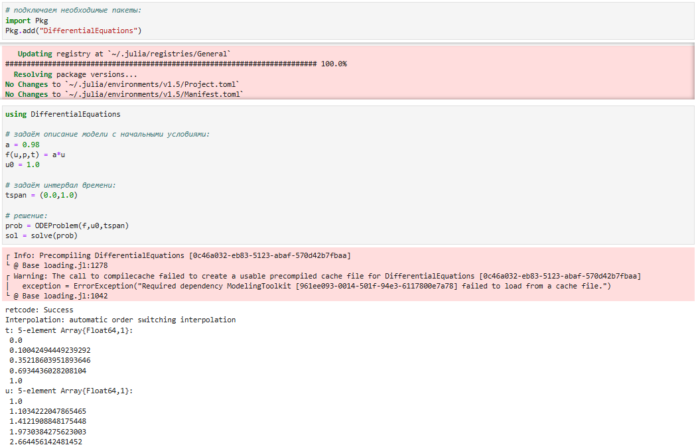

Рисунок 0.1 Модель экспоненциального роста 1

Построение графика, соответствующего полученному решению:

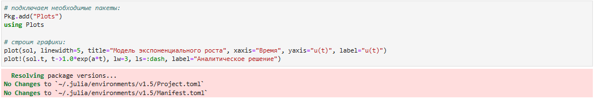

Рисунок 0.2 Модель экспоненциального роста 2

Результат:

Рисунок 0.3 Модель экспоненциального роста 3

Если требуется задать точность решения, то можно воспользоваться параметрами abstol (задаёт близость к нулю) и reltol (задаёт относительную точность). По умолчанию эти параметры имеют значение abstol = 1e-6 и reltol = 1e-3. Для модели экспоненциального роста:

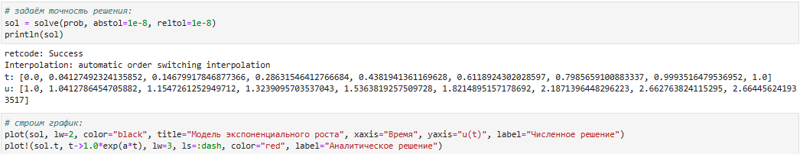

Рисунок 0.4 Модель экспоненциального роста 4

Результат:

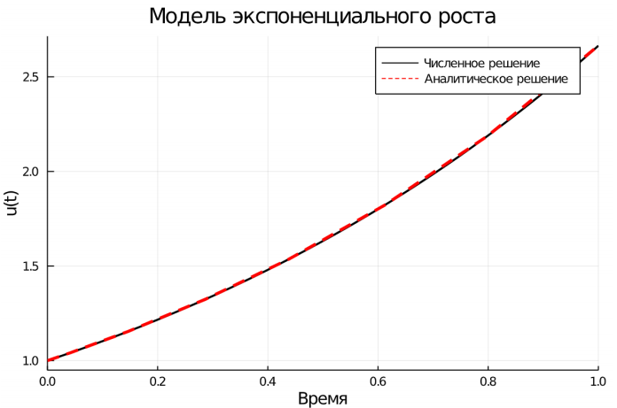

Рисунок 0.5 Модель экспоненциального роста 5

### Система Лоренца
Динамической системой Лоренца является нелинейная автономная система обыкновенных дифференциальных уравнений третьего порядка:

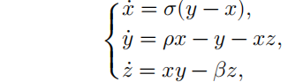

где 𝜎, 𝜌 и 𝛽 — параметры системы (некоторые положительные числа, обычно указывают 𝜎 = 10, 𝜌 = 28 и 𝛽 = 8/3).

Численное решение в Julia будет иметь следующий вид:

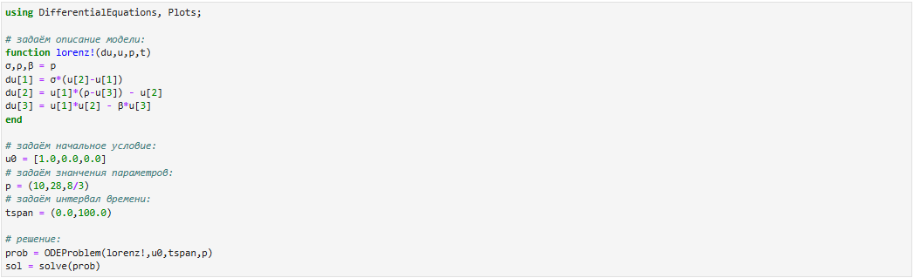

Рисунок 0.6 Система Лоренца 1

Фазовый портрет:

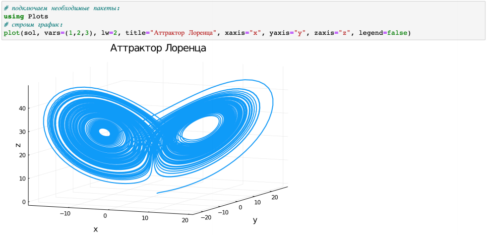

Рисунок 0.7 Система Лоренца 2

Можно отключить интерполяцию:

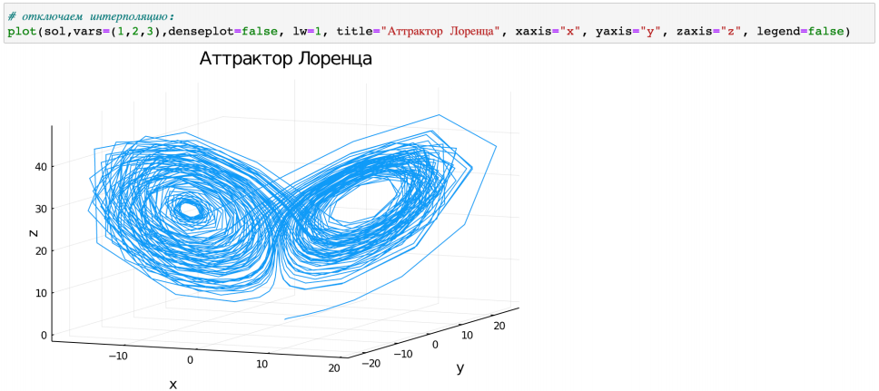

Рисунок 0.8 Система Лоренца 3

### Модель Лотки–Вольтерры
Модель Лотки–Вольтерры описывает взаимодействие двух видов типа «хищник – жертва»:

где 𝑥 — количество жертв, 𝑦 — количество хищников,𝑡 — время, 𝛼, 𝛽, 𝛾, 𝛿 — коэффициенты, отражающие взаимодействия между видами (в данном случае 𝛼 — коэффициент рождаемости жертв, 𝛾 — коэффициент убыли хищников, 𝛽 — коэффициент убыли жертв в результате взаимодействия с хищниками, 𝛿 — коэффициент роста численности хищников).

Рисунок 0.9 Модель Лотки–Вольтерры 1

Результат:

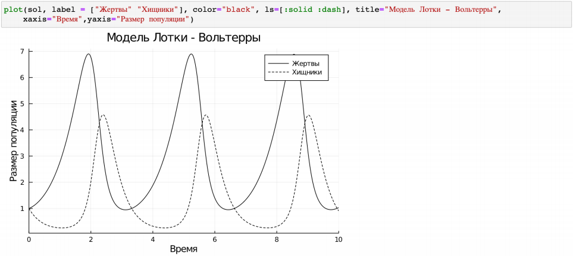

Рисунок 0.10 Модель Лотки–Вольтерры 2

Фазовый портрет:

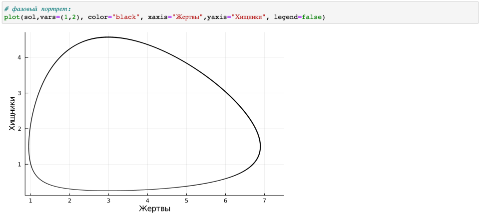

Рисунок 0.11 Модель Лотки–Вольтерры 3

### Задания для самостоятельного выполнения

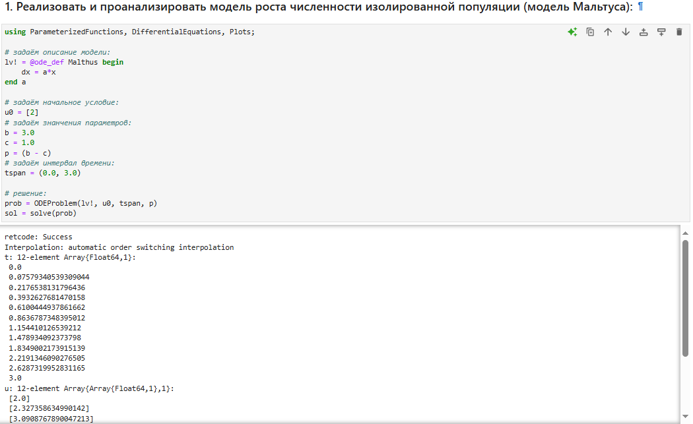

Рисунок 1.1 Код и результат Задания 1-1

Я использовала следующие коэффициенты: a = b - c = 2.0, b = 3.0, c = 1.0 и смоделируем на интервале от 0 до 3. Я решила взять довольно большой коэффициент рождаемости и роста популяции тем самым ожидая на графике очень быстрый рост населения, что в принципе я и получила. Так как за 3 единицы времени размер изолированной популяции с 2 увеличилось до 800 по экспоненте.

Результат:

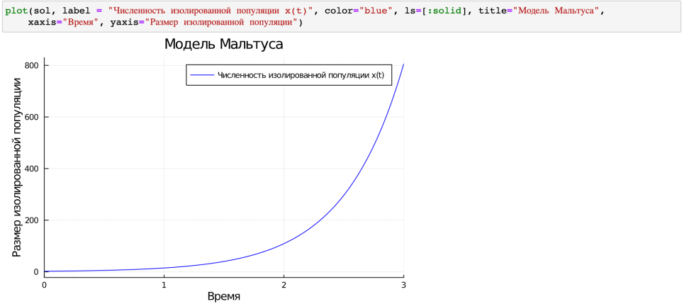

Рисунок 1.2 Код и результат Задания 1-2

Попробую подобрать другие параметры, чтобы сравнить скорость роста популяции. Допустим в этот раз я возьму довольно маленький коэффициент рождаемости и большой коэффициент смертности. Пусть b = 1, c = 3.

Результат:

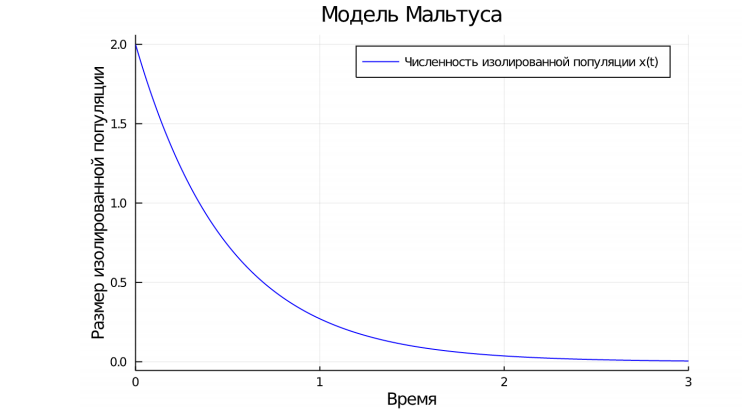

Рисунок 1.3 Код и результат Задания 1-3

Размер популяции за 3 ед. времени резко снизился до 0. Также реализована анимация графика и представлена вместе с программой в архиве.

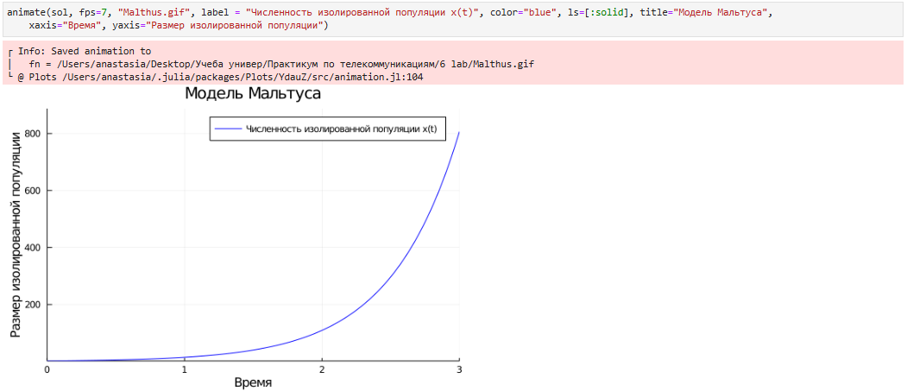

Рисунок 1.4 Код и результат Задания 1-4

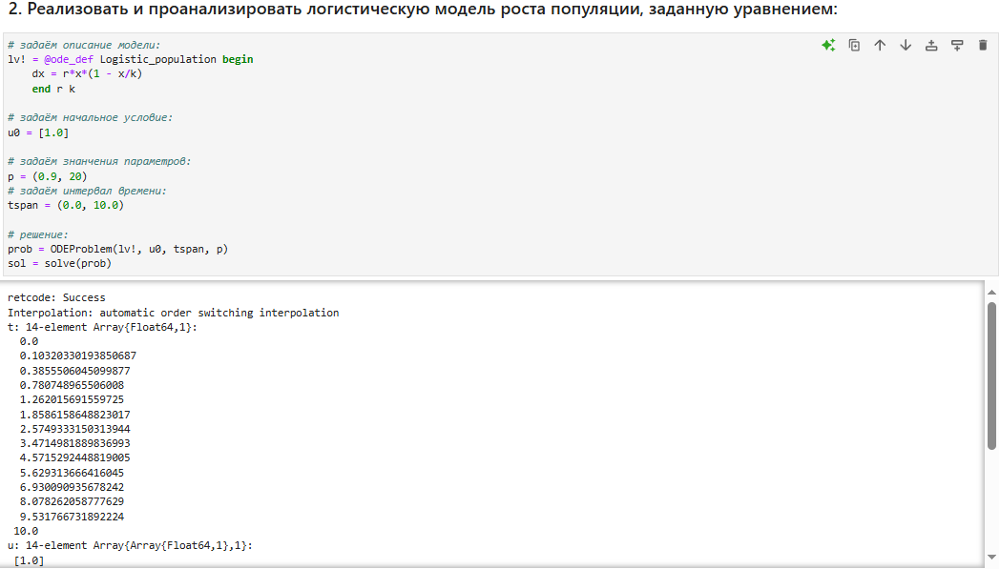

Рисунок 2.1 Код и результат Задания 2-1

Задала коэффициенты следующие r = 0.9, k = 20. Таким образом коэффициент роста равен 0.9, а предельное значение численности популяции равно 20, поэтому график на интервале от 0 до 10 должен достичь по оси y значение 20 и выше не подниматься.

Результат:

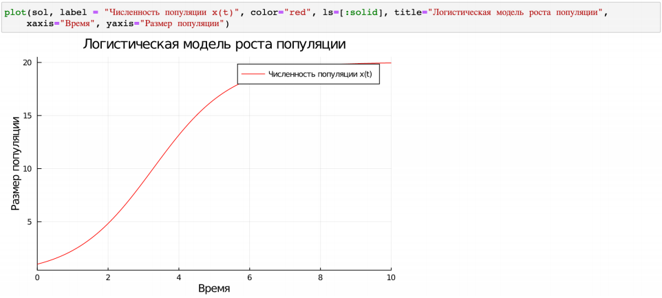

Рисунок 2.2 Код и результат Задания 2-2

Теперь разберем ситуация в которой коэффициент роста популяции намного меньше, допустим 0.1, а предельное значение допустим равно 25 на таком же временном интервале от 0 до 10.

Результат:

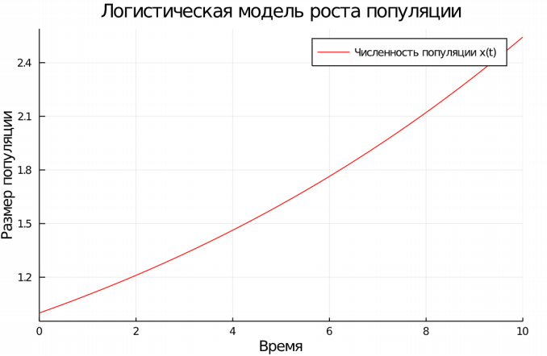

Рисунок 2.3 Код и результат Задания 2-3

Как мы видим, за 10 ед. времени с таким маленьким коэффициентом роста популяции она не успела дойти до предельного значения, увеличим временной промежуток до 80 и посмотрим результат.

Результат:

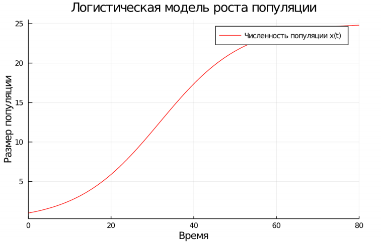

Рисунок 2.4 Код и результат Задания 2-4

Тем самым можно сделать вывод, что чем меньше мы возьмем коэффициент роста популяции, тем медленнее она будет расти.

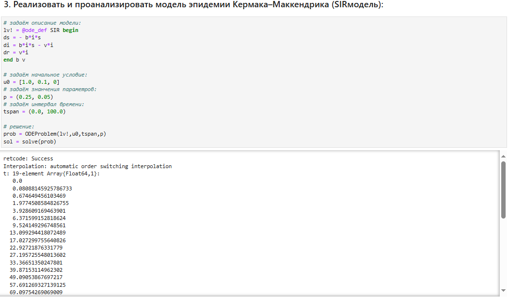

Рисунок 3.1 Код и результат Задания 3-1

Изначально задам 𝛽 = 0.25, 𝜈 = 0.05. Таким образом мы имеем достаточно маленький коэффициент интенсивности выздоровления и достаточно большой коэффициент интенсивности контактов индивидов с последующим инфицированием.

Результат:

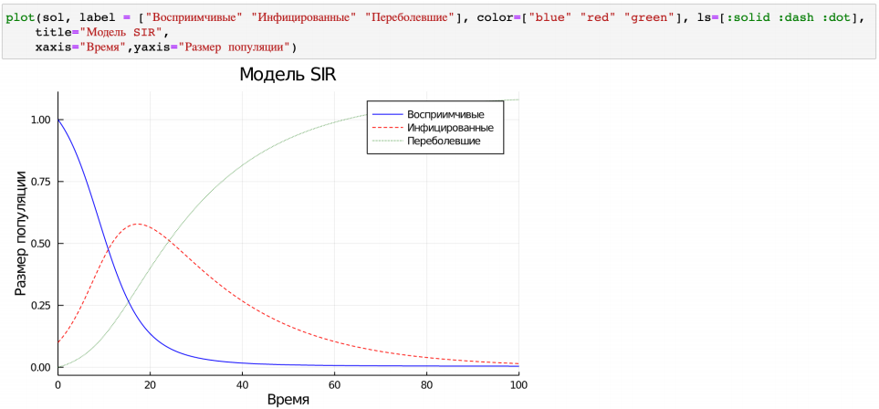

Рисунок 3.2 Код и результат Задания 3-2

Красный график интенсивности эпидемии, показывающей количество одномоментно болеющих индивидов, определяется параметром: R0 = 𝛽/𝜈 = 5. Попробуем уменьшить данный коэффициент интенсивности и посмотрим на различия. Сделаем это за счет уменьшения коэффициента 𝛽, например, 0.15.

Результат:

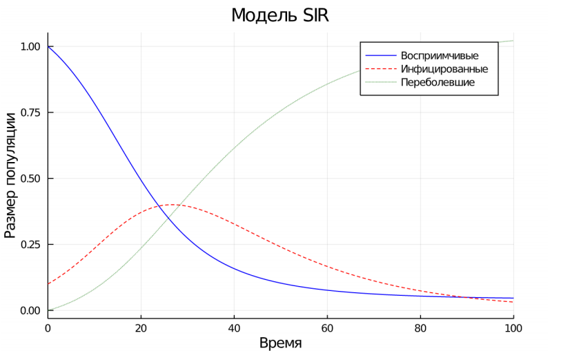

Рисунок 3.3 Код и результат Задания 3-3

Видно, что число инфицированных растет намного медленнее, а также в целом меньшее число людей было инфицировано по истечению времени, нежели в первом случае. Коэффициент интенсивности R0 = 𝛽/𝜈 = 3.

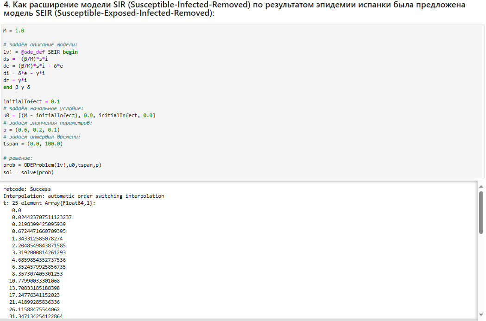

Рисунок 4.1 Код и результат Задания 4-1

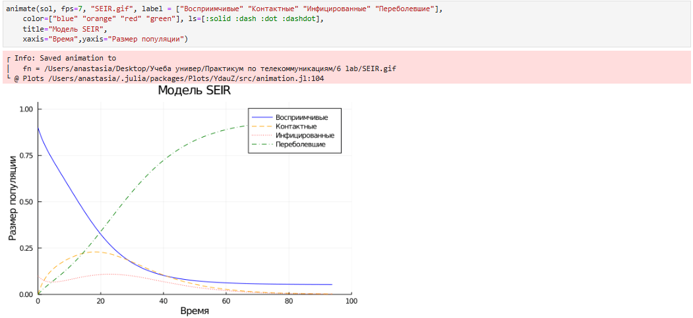

Рисунок 4.2 Код и результат Задания 4-2

1.Определение системы уравнений SEIR.  
   Я задал систему дифференциальных уравнений, в которой:
   - (s(t) — доля (или количество) восприимчивых,  
   - (e(t) — доля «контактных», то есть находящихся в инкубационном периоде,  
   - (i(t) — доля инфицированных,  
   - (r(t) — доля переболевших (удалённых из эпидемического процесса).  
   Дополнительно присутствуют параметры:  
   - beta — скорость контакта (заражения),  
   - delta — скорость перехода из «контактных» в инфицированные,  
   - gamma — скорость выздоровления (или удаления).  

2.Выбор начальных условий.  
   Я задал начальные условия так, чтобы в начале почти вся популяция находилась во «восприимчивом» состоянии (s = M - initialInfect), небольшая часть сразу была инфицирована (i = initialInfect), а «контактных» и переболевших изначально нет (e = 0 и r = 0).  

3.Задание интервала интегрирования и параметров.  
   Я выбрал временной промежуток t in [0, 100]. Параметрам beta, gamma, delta присвоил конкретные числовые значения, соответствующие гипотетическому сценарию развития эпидемии.  

4.Решение системы ODE. 
   Я сформировал объект `ODEProblem` из библиотеки `DifferentialEquations.jl`, передав ему описание системы, начальные условия, интервал времени и кортеж параметров. Затем с помощью функции `solve()` получил численное решение.  

5.Визуализация и анимация.   
   - Итоговая GIF-анимация иллюстрирует, как SEIR-модель описывает развитие эпидемии с учётом «скрытого» периода состояние (e(t).  

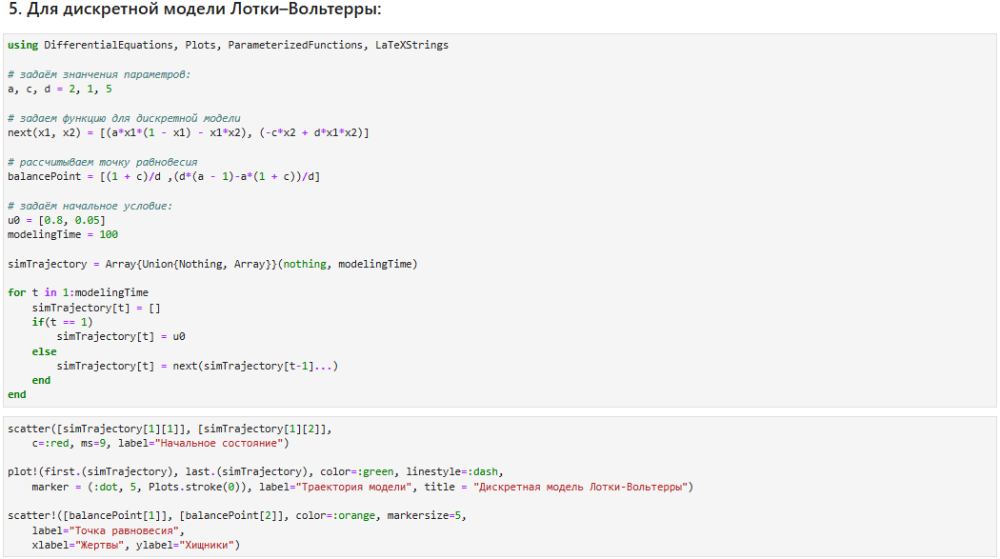

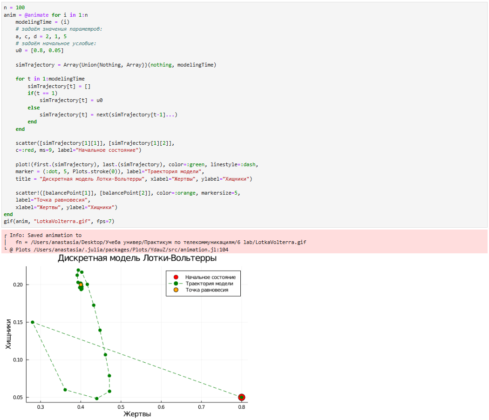

Рисунок 5.1 Код и результат Задания 5-1

1.Вычисление точки равновесия. 
   Точка равновесия (X_1^*), (X_2^*) получается из условия, что Delta X_1 = 0 и Delta X_2 = 0. Я аналитически нашёл это решение и сохранил в переменную `balancePoint`.

2.Численное решение и построение траектории.
   - Я выбрал начальное состояние X_1(0)=0.8, X_2(0)=0.05 и задал количество итераций (`modelingTime`), после чего в цикле по шагам вычислял следующие значения жертв и хищников с помощью функции `next`.
   - Для визуализации создал фазовый портрет (ось абсцисс — жертвы, ось ординат — хищники) и отобразил:
     - начальную точку,
     - траекторию, по которой система перемещается,
     - точку равновесия.

3.Анимация.
   - Чтобы показать, как траектория «растёт» во времени, я использовал макрос `@animate`. На каждом шаге анимации я пересчитывал систему вплоть до текущего момента и рисовал результат.
   - Наконец, собрал все кадры в GIF-файл с помощью `gif(anim, "LotkaVolterra.gif", fps=7)`.

Рисунок 6.1 Код и результат Задания 6-1

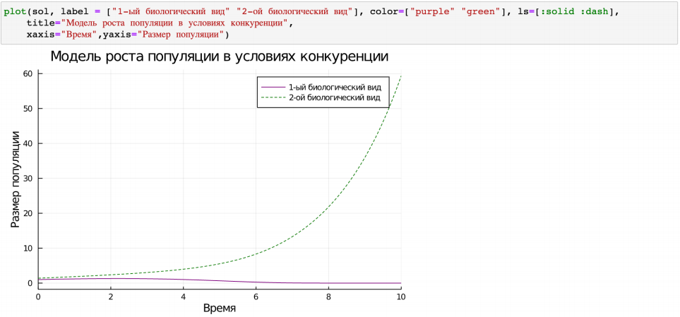

Рисунок 6.2 Код и результат Задания 6-2

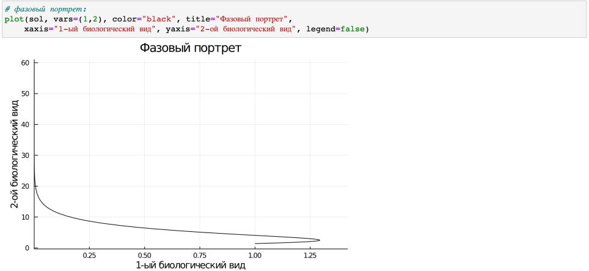

Рисунок 6.3 Код и результат Задания 6-3

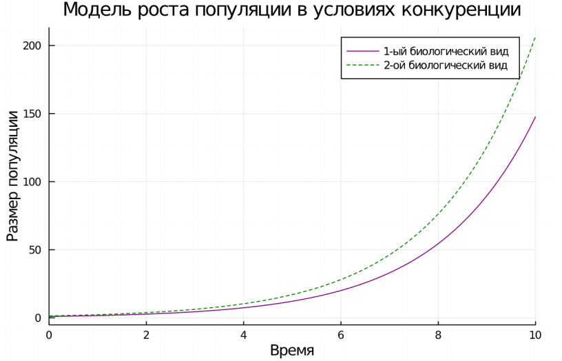

Рисунок 6.4 Код и результат Задания 6-4

В данной модели мы задаем 2 параметра, насколько я понимаю первый отвечает за рост популяции обеих групп, а второй это коэффициент конкурентности. То есть насколько одна группа конкурирует с другой.
Также в данной модели я заметила, что сильно влияют начальные значения. То есть количество особей в двух моделируемых группах на начало времени. В моем случае 1-я группа имеет начальное значение 1, а вторая группа - 1.4. Следовательно по моим предположениям, второй биологический вид должен выиграть в данной конкурентной среде и начать быстро расти.
вышло так, что второй вид полностью подавил первый биологический вид.

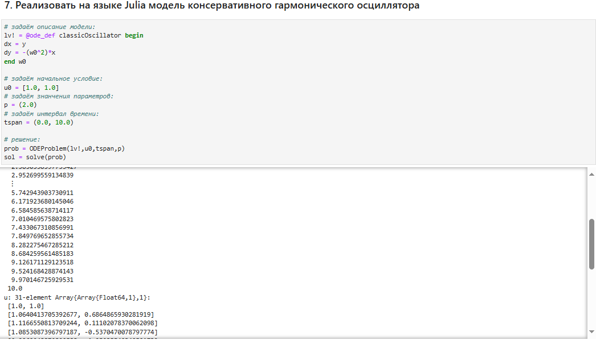

Рисунок 7.1 Код и результат Задания 7-1

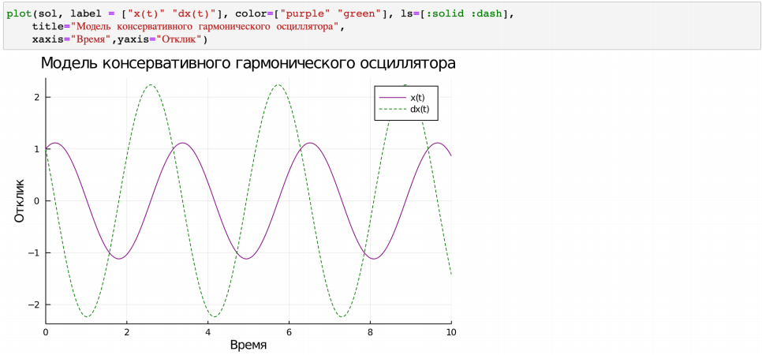

Рисунок 7.2 Код и результат Задания 7-2

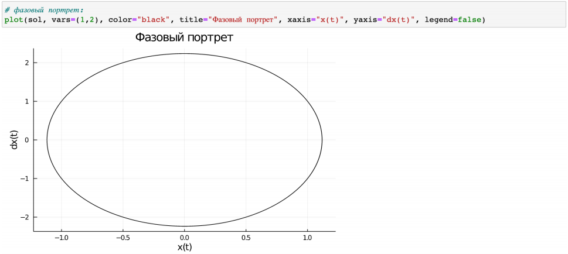

Рисунок 7.3 Код и результат Задания 7-3

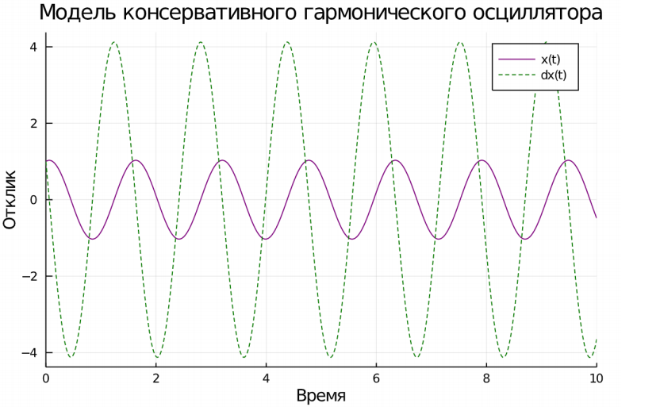

Рисунок 7.4 Код и результат Задания 7-4

1.Начальные условия.  
   Я задал начальное смещение x(0)=1.0 и начальную скорость dot{x}(0)=1.0. Это позволяет наблюдать «свободные» колебания без дополнительного затухания или внешнего воздействия.

2.Численное решение.
   Я оформил задачу как `ODEProblem(lv!, u0, tspan, p)` и решил её с помощью `solve(prob)`. Получил решение в виде временных рядов для x(t) и dot{x}(t).

3.Построение графиков и анимации. 
   - Построил график x(t) и dot{x}(t) от времени, чтобы увидеть колебания и убедиться, что они действительно гармонические.  
   - Построил фазовый портрет (ось абсцисс — x, ось ординат — dot{x}, где траектория представляет собой замкнутую эллиптическую кривую, характерную для консервативного осциллятора.  
   - Создал анимацию, чтобы наглядно показать, как решения меняются во времени, и сохранил её в виде GIF-файла.

В итоге удалось продемонстрировать, что в отсутствии диссипации (затухания) система совершает периодические колебания.

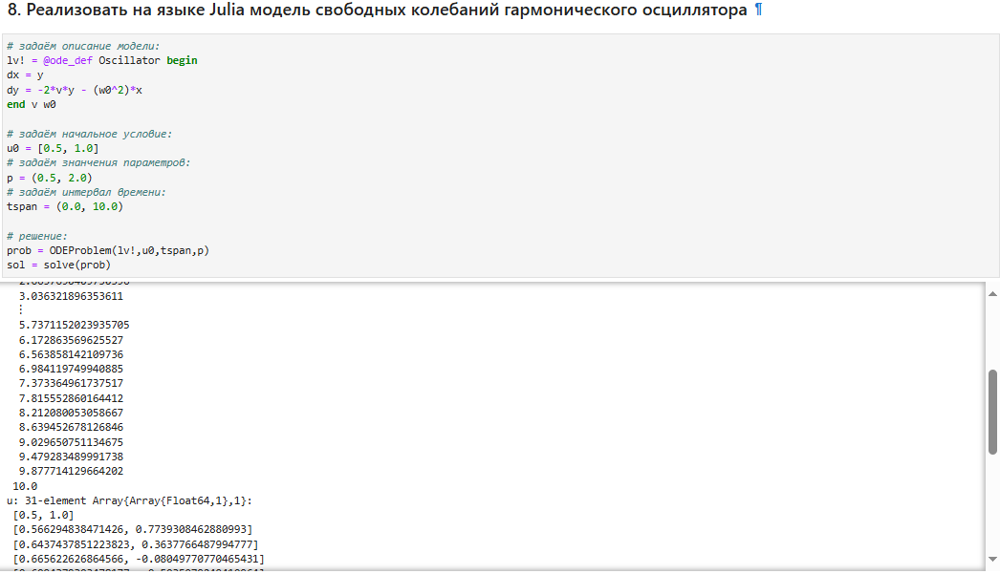

Рисунок 8.1 Код и результат Задания 8-1

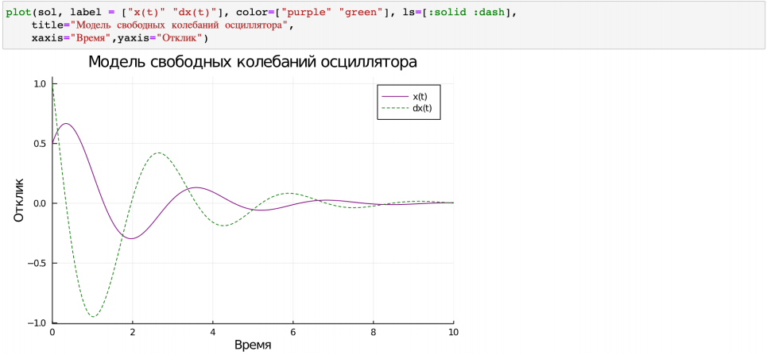

Рисунок 8.2 Код и результат Задания 8-2

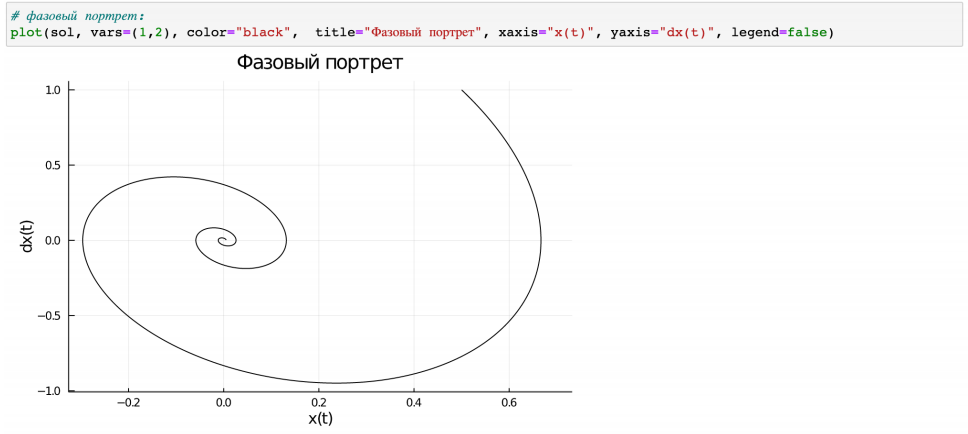

Рисунок 8.3 Код и результат Задания 8-3

Рисунок 8.4 Код и результат Задания 8-4

1.Выбор параметров и начальных условий  
   - Параметр gamma = 0.5 задал для иллюстрации умеренного затухания; omega_0 = 2.0 — для определённой «скорости» колебаний.
   - Начальное смещение x(0) = 0.5 и начальная скорость dot{x}(0) = 1.0 выбраны, чтобы наблюдать свободные затухающие колебания.

2.Численное решение  
   - Сформировал задачу `ODEProblem` (из пакета `DifferentialEquations.jl`), передал описание системы, вектор начальных условий и параметры.  
   - Функция `solve(prob)` вернула решение, по которому можно строить графики.

3.Построение графиков и анимации 
   - Построил во времени функции x(t) и dot{x}(t), чтобы увидеть колебания и их затухание.  
   - На фазовом портрете ось x, ось dot{x} затухающие колебания визуально проявляются в виде спиральной траектории, «закручивающейся» к равновесию.  
   - С помощью `animate` создал GIF-файл, на котором видно, как решение эволюционирует по времени.

Таким образом, получилась модель свободных (но затухающих) колебаний гармонического осциллятора, позволяющая наглядно проследить динамику как в координате времени, так и на фазовом портрете.

# Вывод

Я освоил специализированные пакеты для решения задач в непрерывном и дискретном времени
