---
## Front matter
lang: ru-RU
title: Введение в работу с данными
author: |
	 Гань Чжаолун\inst{1}

institute: |
	\inst{1}Российский Университет Дружбы Народов

date: 26 декабрь, 2024, Москва, Россия

## Formatting
mainfont: PT Serif
romanfont: PT Serif
sansfont: PT Sans
monofont: PT Mono
toc: false
slide_level: 2
theme: metropolis
header-includes: 
 - \metroset{progressbar=frametitle,sectionpage=progressbar,numbering=fraction}
 - '\makeatletter'
 - '\beamer@ignorenonframefalse'
 - '\makeatother'
aspectratio: 43
section-titles: true

---

# Цели и задачи работы

Основной целью работы является специализированных пакетов Julia для обработки данных.

# Цель лабораторной работы

### Используя Jupyter Lab, повторите примеры из раздела 7.2.

Я повторю все задание 7.2 целиком

### Задания для самостоятельного выполнения

### 7.4.1. Кластеризация
1.Загружаем данные

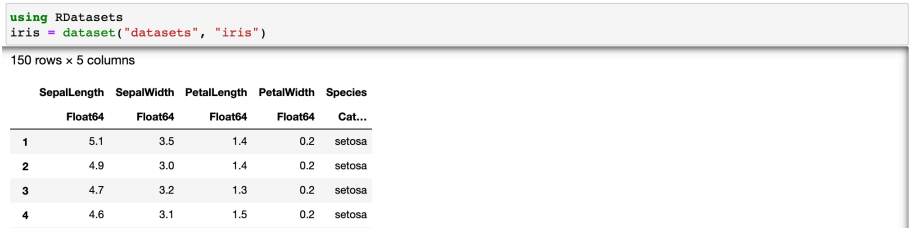

2.Для кластеризации я выбрала 2 признака - SepalLength и PetalLength. Построим в начале точечный график их распределения:

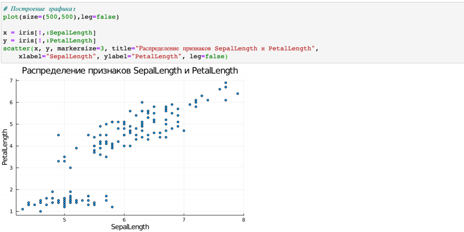

3.Добавим данные в новый фрейм:

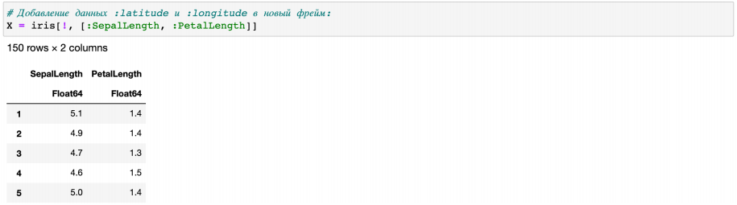

4.Конвертируем данные в матричный вид и транспонируем их:

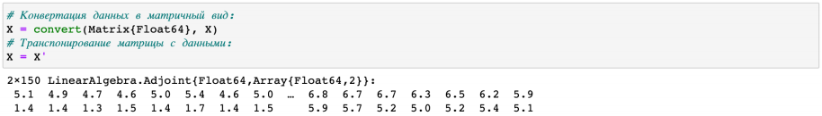

5.Я выдвинула гипотезу, что данные признаки могут зависеть от вида Ириса. Поэтому посчитаем количество уникальных видов и возьмем данное количество кластеров:

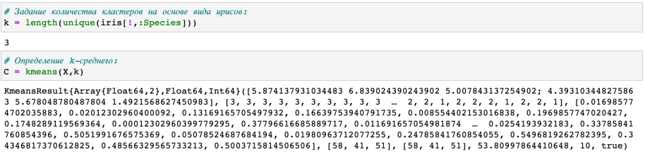

6.Формируем фрейм данных с указанием кластера:

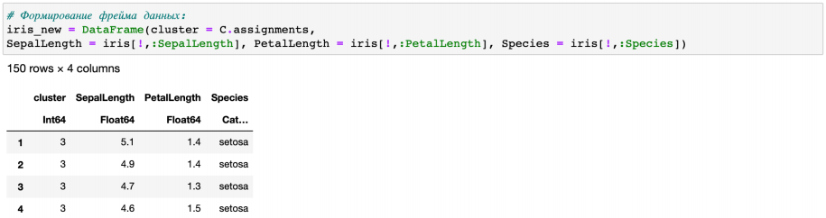

7.Построим график датафрейма с распределением цветов по кластерам:

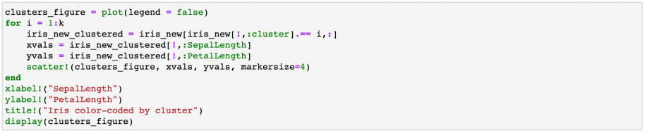
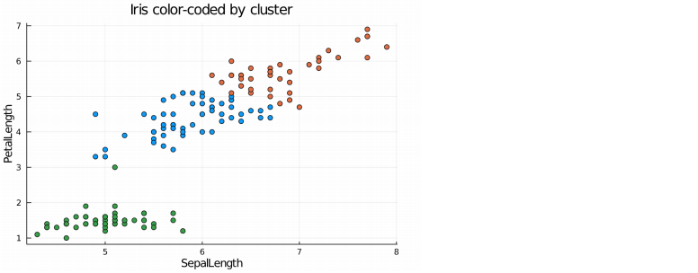

8.Теперь построим графики с распределением цветов по самому виду Ирисов:

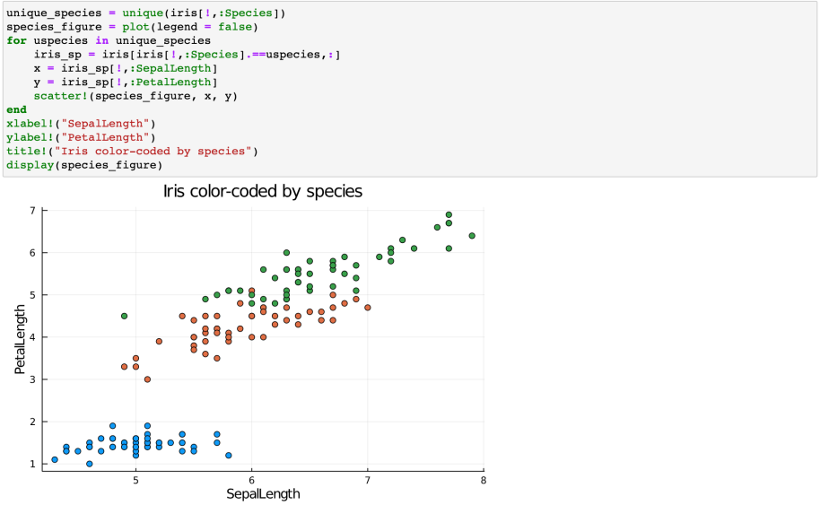

### 7.4.2. Регрессия (метод наименьших квадратов в случае линейной регрессии)
#### Часть 1

Пусть регрессионная зависимость является линейной. Матрица наблюдений факторов 𝑋 имеет размерность 𝑁 × 3 randn, массив результатов 𝑁 × 1, регрессионная зависимость является линейной. Найдите МНК-оценку для линейной модели.

Для начала запишем данные:

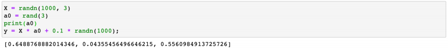

Далее я создала функцию linear_regression_model. В которой изначально создаю матрицу X2, состоящую из единиц. Далее присоединяю этот столбец к X. А затем решаю систему линейных уравнений. Выходит результат: -0.00140559

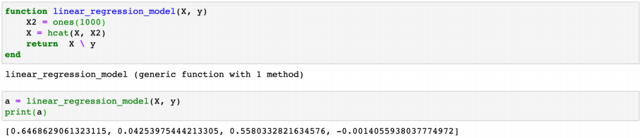

Добавление столбца с единицами обусловлено тем, что мы ищем свободный коэффициент. Суть метода наименьших квадратов:

Задача заключается в нахождении коэффициентов линейной зависимости, при которых функция двух переменных а и b принимает наименьшее значение. То есть, при данных а и b сумма квадратов отклонений экспериментальных данных от найденной прямой будет наименьшей. Таким образом, решение примера сводится к нахождению экстремума функции двух переменных.

Сравню полученные результаты с результатами использования llsq из MultivariateStats.jl.

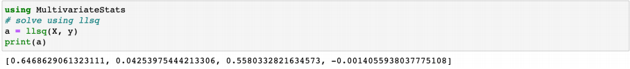

Как мы видим результат практически идентичен.

Сравню результаты с результатами использования регулярной регрессии наименьших квадратов из GLM.jl.

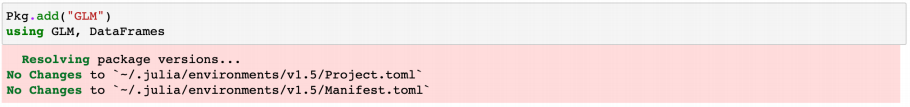

После установки пакета создадим датафрейм, в который запишем y и разобьем X на 3 столбца - x1, x2 и x3.

Результат:

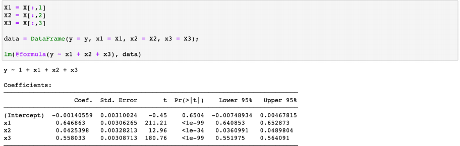

Результат получился таким же. Intercept во всех 3 случаях принимало значение -0.00140559.

#### Часть 2 
Найдите линию регрессии, используя данные (𝑋, 𝑦). Постройте график (𝑋, 𝑦), используя точечный график. Добавьте линию регрессии, используя abline!. Добавьте заголовок «График регрессии» и подпишите оси 𝑥 и 𝑦.

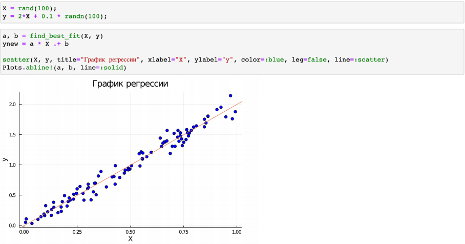

### 7.4.3. Модель ценообразования биномиальных опционов 
a) Пусть 𝑆 = 100, 𝑇 = 1, 𝑛 = 10000, 𝜎 = 0.3 и 𝑟 = 0.08. Попробуйте построить траекторию курса акций. Функция rand () генерирует случайное число от 0 до 1. Вы можете использовать функцию построения графика из библиотеки графиков.

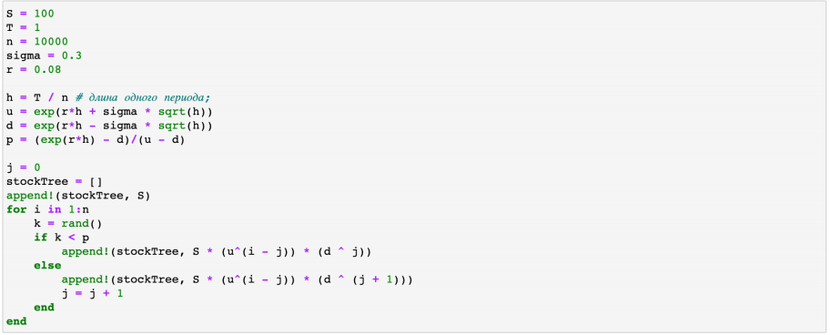

Построим график:

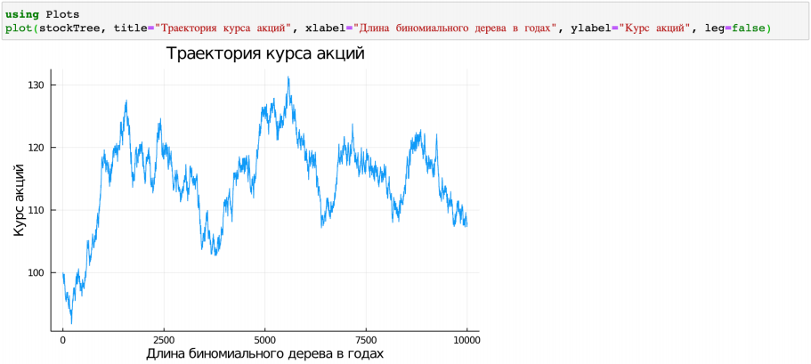

b) Создайте функцию createPath (S :: Float64, r :: Float64, sigma :: Float64, T :: Float64, n :: Int64), которая создает траекторию цены акции с учетом начальных параметров. Используйте createPath, чтобы создать 10 разных траекторий и построить их все на одном графике.

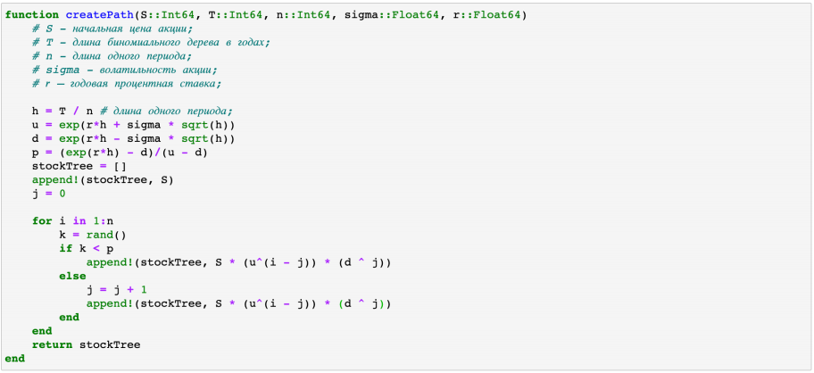

Нарисуем 10 траекторий на 1 графике с помощью цикла:

c) Распараллельте генерацию траектории. Можете использовать Threads.@threads, pmap и @parallel.

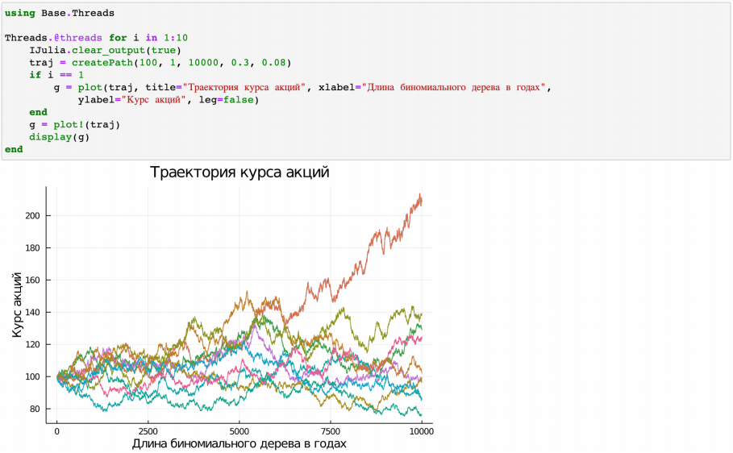

# Вывод

Я познакомилась с пакетами для обработки данных в Julia, а также изучил модель ценообразования биномиальных опционов.
