# Отчёт по лабораторной работе №7
### Введение в работу с данными
## Гань Чжаолун

# Цель работы

Основной целью работы является специализированных пакетов Julia для обработки данных.

# Выполнение лабораторной работы

### 7.2.1.1. Считывание данных
В Julia для работы с такого рода структурами данных используют пакеты CSV, DataFrames, RDatasets, FileIO:

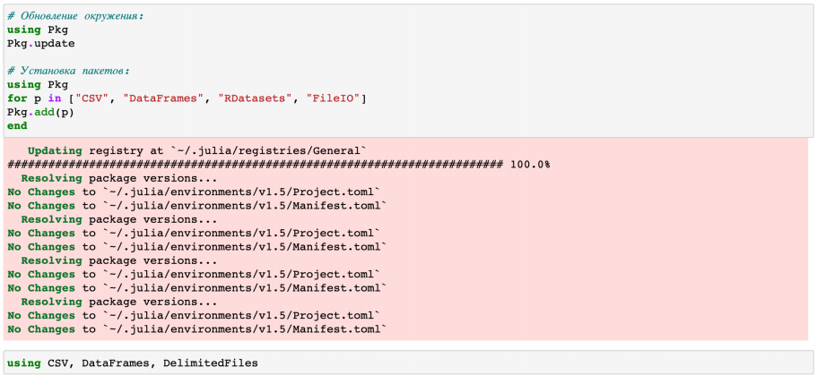

Для заполнения массива данными для последующей обработки требуется считать данные из исходного файла и записать их в соответствующую структуру:

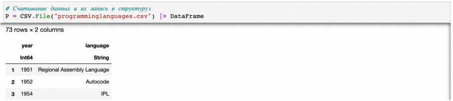

Далее приведём пример функции, в которой на входе указывается название языка программирования, а на выходе — год его создания:

Следует обратить внимание, что в данной функции мы никак не обрабатываем случай, когда языка программирования, переданного в функцию не существует.

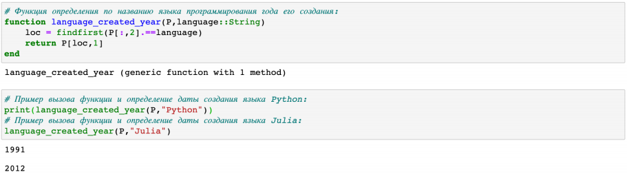

В таблице содержится запись о языках программирования Julia и Python, вывод годов произошел успешно. Однако если мы попробуем написать julia с маленькой буквы, то получим ошибку, так как датафрейм не содержит такой записи.

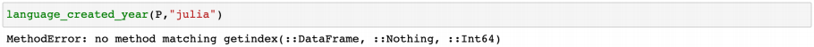

Для того, чтобы убрать в функции зависимость данных от регистра,  необходимо изменить исходную функцию следующим образом:

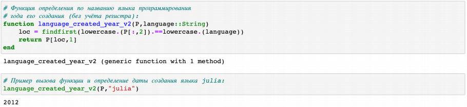

Можно считывать данные построчно, с элементами, разделенными заданным разделителем:

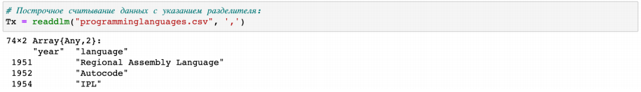

### 7.2.1.2. Запись данных в файл
Предположим, что требуется записать имеющиеся данные в файл. Для записи данных в формате CSV можно воспользоваться следующим вызовом:

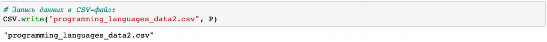

Можно задать тип файла и разделитель данных:

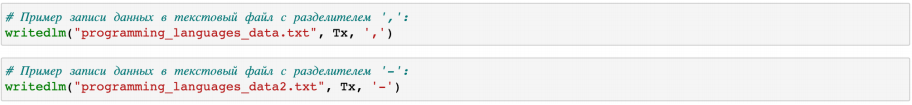

Можно проверить, используя readdlm, корректность считывания созданного текстового файла:

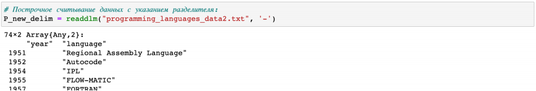

### 7.2.1.3. Словари
При работе с данными бывает удобно записать их в формате словаря.

При инициализации словаря можно задать конкретные типы данных для ключей и значений:

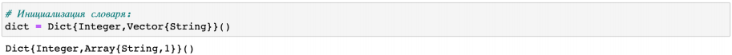

а можно инициировать пустой словарь, не задавая строго структуру:

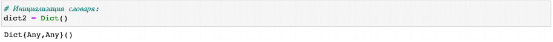

Далее требуется заполнить словарь ключами и годами, которые содержат все языки программирования, созданные в каждом году, в качестве значений:

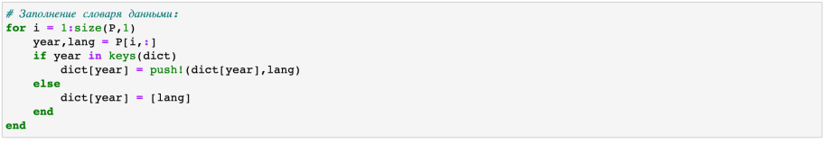

В результате при вызове словаря можно, выбрав любой год, узнать, какие языки программирования были созданы в этом году:

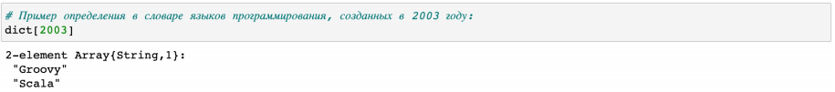

### 7.2.1.4. DataFrames
На примере с данными о языках программирования и годах их создания зададим структуру DataFrame:

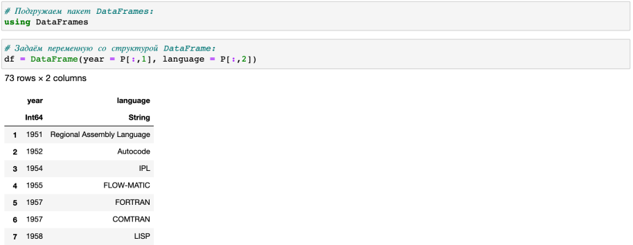

Если требуется получить доступ к столбцам по имени заголовка, то необходимо добавить к имени заголовка двоеточие:

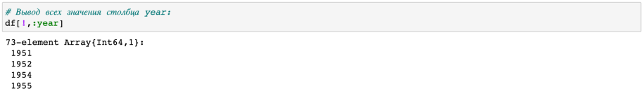

Пакет DataFrames предоставляет возможность с помощью description получить основные статистические сведения о каждом столбце во фрейме данных:

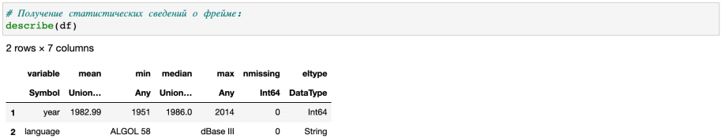

### 7.2.1.5. RDatasets
С данными можно работать также как с наборами данных через пакет RDatasets языка R:

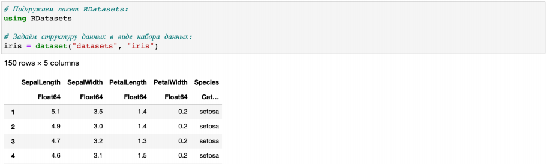

В данном случает набор данных содержит сведения о цветах. При этом следует иметь в виду, что данные, загруженные с помощью набора данных, хранятся в виде DataFrame:

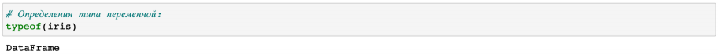

Пакет RDatasets также предоставляет возможность с помощью description получить основные статистические сведения о каждом столбце в наборе данных:

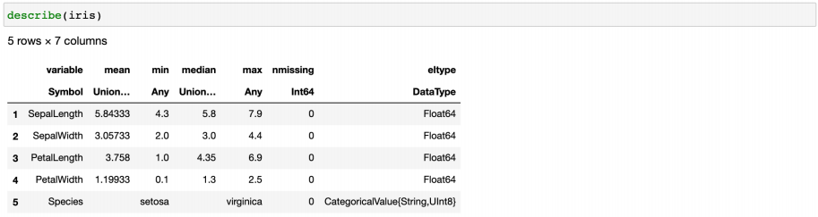

### 7.2.1.6. Работа с переменными отсутствующего типа (Missing Values)
Пакет DataFrames позволяет использовать так называемый «отсутствующий» тип:

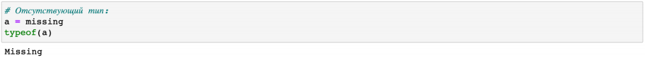

В операции сложения числа и переменной с отсутствующим типом значение также будет иметь отсутствующий тип:

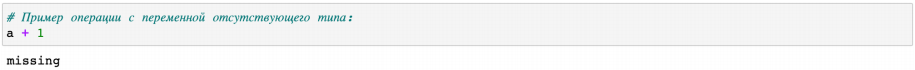

Приведём пример работы с данными, среди которых есть данные с отсутствующим типом.

Предположим есть перечень продуктов, для которых заданы калории:

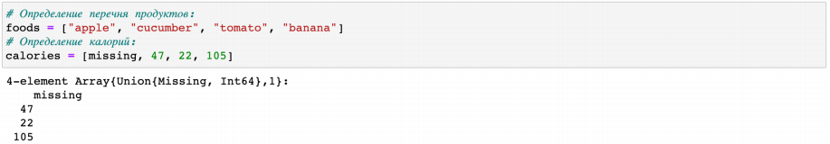

В массиве значений калорий есть значение с отсутствующим типом:

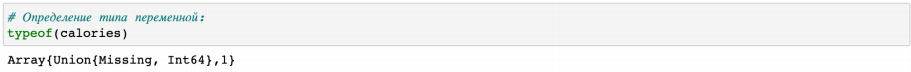

При попытке получить среднее значение калорий, ничего не получится из-за наличия переменной с отсутствующим типом:

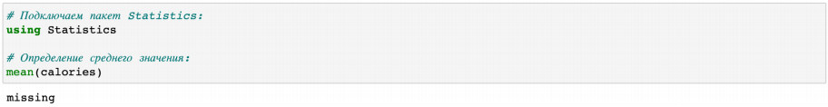

Для решения этой проблемы необходимо игнорировать отсутствующий тип:

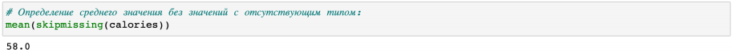

Далее показано, как можно сформировать таблицы данных и объединить их в один фрейм:

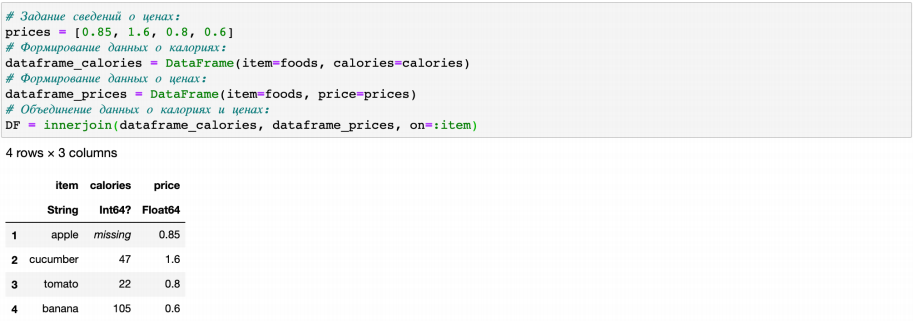

В данном пункте выдавалась ошибка относительно использования join с датафреймами. Я использовала функцию innerjoin, так как join использовать нельзя. Ссылка на документацию, в которой описаны методы присоединения таблиц для датафреймов:

https://dataframes.juliadata.org/stable/man/joins/
### 7.2.1.7. FileIO
В Julia можно работать с так называемыми «сырыми» данными, используя пакет FileIO:

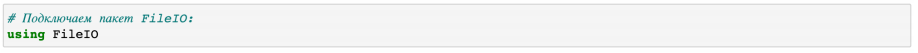

Попробуем посмотреть, как Julia работает с изображениями. Подключим соответствующий пакет:

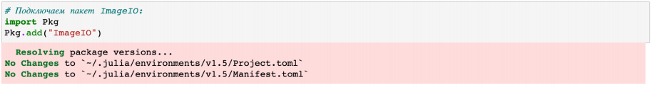

Загрузим изображение (в данном случае логотип Julia):

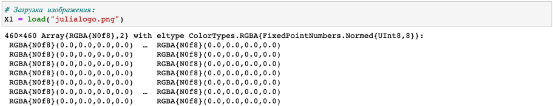

Julia хранит изображение в виде множества цветов:

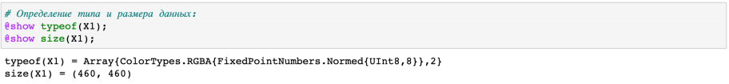

### 7.2.2. Обработка данных: стандартные алгоритмы машинного обучения в Julia 
### 7.2.2.1. Кластеризация данных. Метод k-средних
Рассмотрим задачу кластеризации данных на примере данных о недвижимости. Файл с данными houses.csv содержит список транзакций с недвижимостью в районе Сакраменто, о которых было сообщено в течение определённого числа дней. 

Сначала подключим необходимые для работы пакеты:

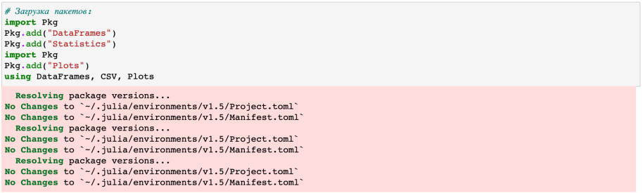

Затем загрузим данные:

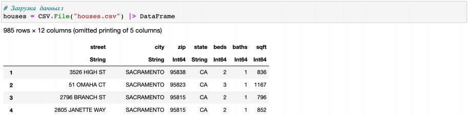

Построим график цен на недвижимость в зависимости от площади :

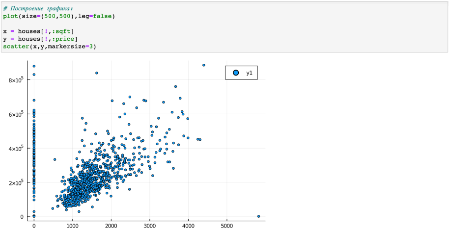

Как видно из графика, имеются так называемые «артефакты», т.е. проявляются отсутствующие или невозможные сведения в исходных данных, например, цены на недвижимость нулевой площади. 

Для того чтобы избавиться от такого эффекта, можно отфильтровать и исключить такие значения, получить более корректный график цен :

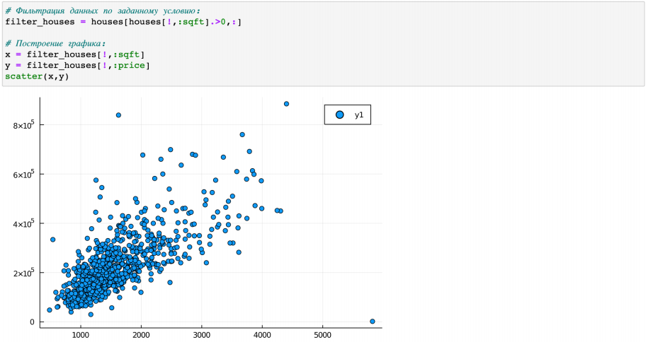

Используя для фильтрации значений функцию by пакета DataFrames и для вычисления среднего значения функцию mean пакета Statistics, можно посмотреть среднюю цену домов определённого типа:

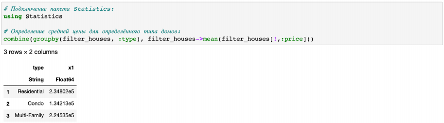

В данном пункте также была ошибка, функция by не доступна для использования. Поэтому из предложенных вариантов я выбрала combine(groupby(), …).

Отфильтровав таким образом данные, можно приступить к формированию кластеров. Сначала подключаем необходимые пакеты и формируем данные в нужном виде:

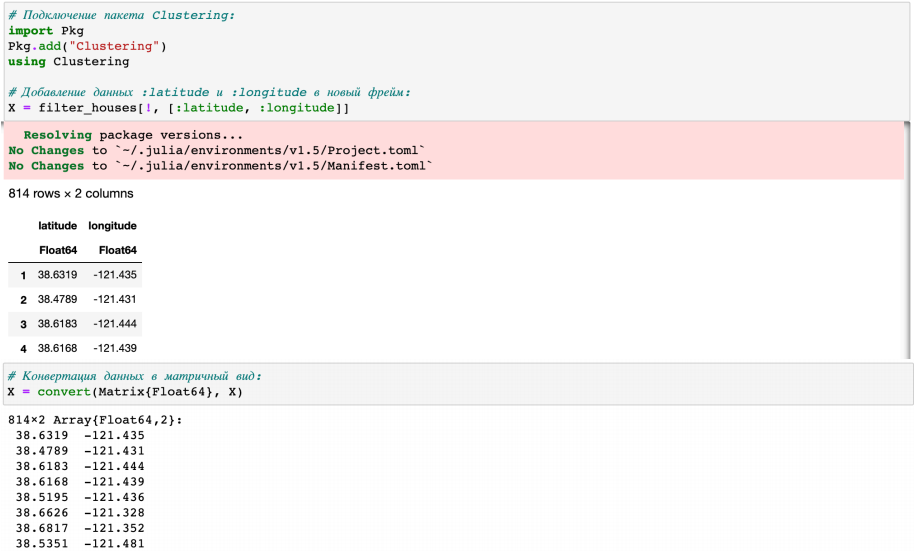

Каждая функция хранится в виде строки X, но можно транспонировать получившуюся матрицу, чтобы иметь возможность работать с столбцами данных X:

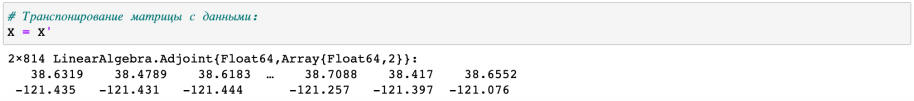

В качестве критерия для формирования кластеров данных и определения количества кластеров попробуем использовать количество почтовых индексов:

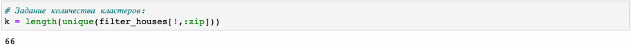

Для определения k-среднего можно воспользоваться соответствующей функцией пакета Statistics:

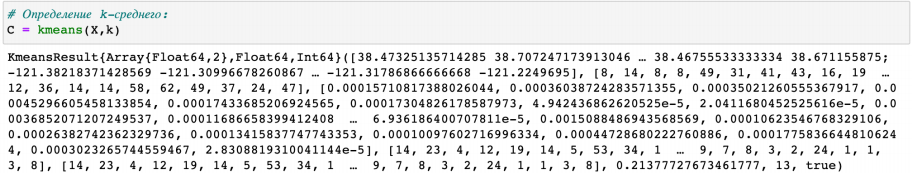

Далее сформируем новый фрейм, включающий исходные данные о недвижимости и столбец с данными о назначенном каждому дому кластере:

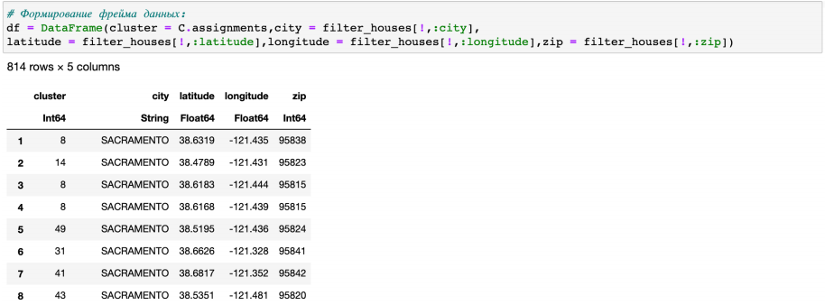

Построим график, обозначив каждый кластер отдельным цветом:

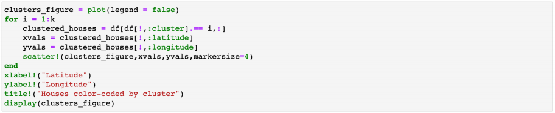

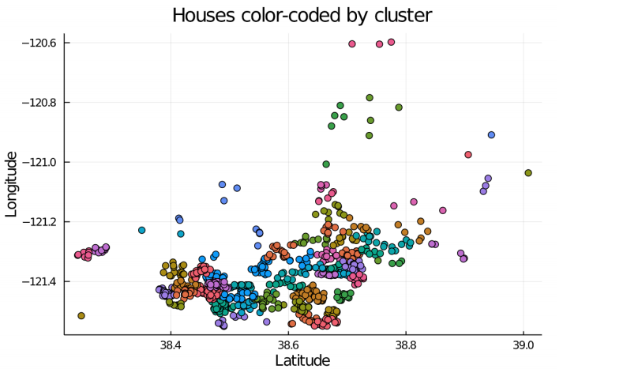

Построим график, раскрасив кластеры по почтовому индексу:

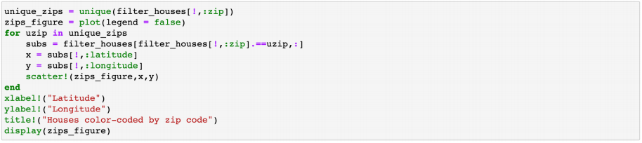

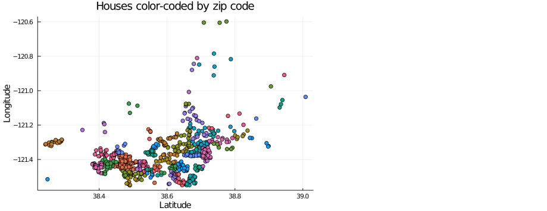

### 7.2.2.2. Кластеризация данных. Метод k ближайших соседей
Рассмотрим использование метода 𝑘 ближайших соседей на примере того же файла с данными об объектах недвижимости в Сакраменто.

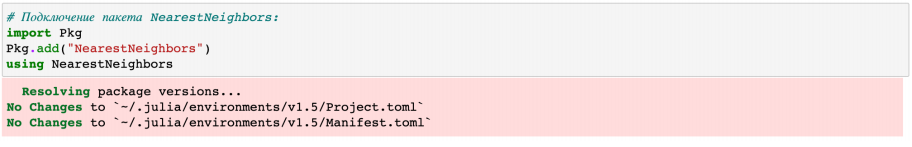

Найдём k-среднее одного из объектов недвижимости:

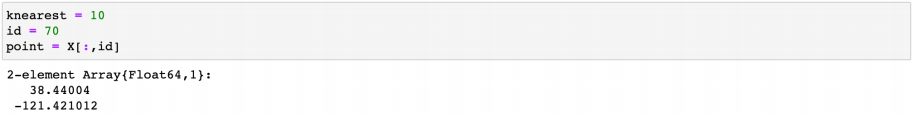

Определим ближайших соседей:

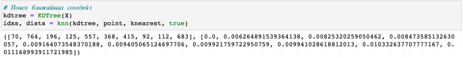

Отобразим на графике соседей выбранного объекта недвижимости :

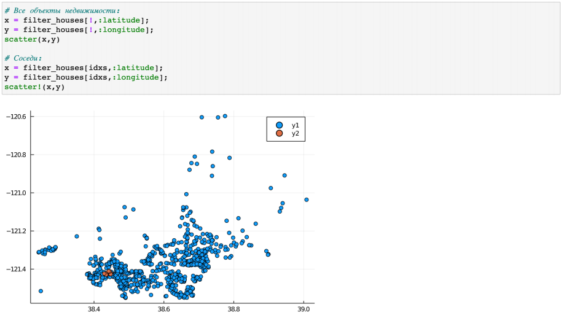

Используя индексы idxs и функцию :city для индексации в DataFrame  filter_houses, можно определить районы соседних домов:

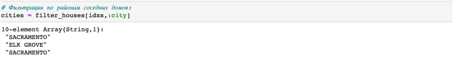

### 7.2.2.3. Обработка данных. Метод главных компонент
На примере с данными о недвижимости попробуем уменьшить размеры данных о цене и площади из набора данных домов:

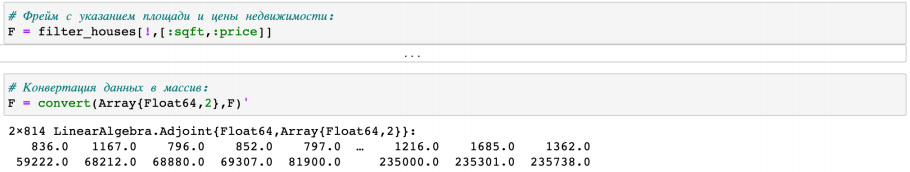

Далее подключим пакет MultivariateStats, чтобы использовать метод главных компонент:

Далее используем специальную функцию fit и приведём имеющийся набор данных к распределению, к которому можно применить метод главных компонент (PCA):

Далее воспользуемся функцией reconstruct, чтобы выделить данные с главными компонентами в отдельную переменную Xr, значения которой в последствии можно вывести на графике :

### 7.2.2.4. Обработка данных. Линейная регрессия
Зададим случайный набор данных (можно использовать и полученные экспериментальным путём какие-то данные). Попробуем найти для данных лучшее соответствие:

Определим функцию линейной регрессии:

Применим функцию линейной регрессии для построения соответствующего графика значений:

Сгенерируем больший набор данных:

Для сравнения реализуем подобный код на языке Python:

Используем пакет для анализа производительности, чтобы провести сравнение:

# 7.4. Задания для самостоятельного выполнения
### 7.4.1. Кластеризация
1.Загружаем данные

2.Для кластеризации я выбрала 2 признака - SepalLength и PetalLength. Построим в начале точечный график их распределения:

3.Добавим данные в новый фрейм:

4.Конвертируем данные в матричный вид и транспонируем их:

5.Я выдвинула гипотезу, что данные признаки могут зависеть от вида Ириса. Поэтому посчитаем количество уникальных видов и возьмем данное количество кластеров:

6.Формируем фрейм данных с указанием кластера:

7.Построим график датафрейма с распределением цветов по кластерам:

8.Теперь построим графики с распределением цветов по самому виду Ирисов:

### 7.4.2. Регрессия (метод наименьших квадратов в случае линейной регрессии)
#### Часть 1

Пусть регрессионная зависимость является линейной. Матрица наблюдений факторов 𝑋 имеет размерность 𝑁 × 3 randn, массив результатов 𝑁 × 1, регрессионная зависимость является линейной. Найдите МНК-оценку для линейной модели.

Для начала запишем данные:

Далее я создала функцию linear_regression_model. В которой изначально создаю матрицу X2, состоящую из единиц. Далее присоединяю этот столбец к X. А затем решаю систему линейных уравнений. Выходит результат: -0.00140559

Добавление столбца с единицами обусловлено тем, что мы ищем свободный коэффициент. Суть метода наименьших квадратов:

Задача заключается в нахождении коэффициентов линейной зависимости, при которых функция двух переменных а и b принимает наименьшее значение. То есть, при данных а и b сумма квадратов отклонений экспериментальных данных от найденной прямой будет наименьшей. Таким образом, решение примера сводится к нахождению экстремума функции двух переменных.

Сравню полученные результаты с результатами использования llsq из MultivariateStats.jl.

Как мы видим результат практически идентичен.

Сравню результаты с результатами использования регулярной регрессии наименьших квадратов из GLM.jl.

После установки пакета создадим датафрейм, в который запишем y и разобьем X на 3 столбца - x1, x2 и x3.

Результат:

Результат получился таким же. Intercept во всех 3 случаях принимало значение -0.00140559.

#### Часть 2 
Найдите линию регрессии, используя данные (𝑋, 𝑦). Постройте график (𝑋, 𝑦), используя точечный график. Добавьте линию регрессии, используя abline!. Добавьте заголовок «График регрессии» и подпишите оси 𝑥 и 𝑦.

### 7.4.3. Модель ценообразования биномиальных опционов 
a) Пусть 𝑆 = 100, 𝑇 = 1, 𝑛 = 10000, 𝜎 = 0.3 и 𝑟 = 0.08. Попробуйте построить траекторию курса акций. Функция rand () генерирует случайное число от 0 до 1. Вы можете использовать функцию построения графика из библиотеки графиков.

Построим график:

b) Создайте функцию createPath (S :: Float64, r :: Float64, sigma :: Float64, T :: Float64, n :: Int64), которая создает траекторию цены акции с учетом начальных параметров. Используйте createPath, чтобы создать 10 разных траекторий и построить их все на одном графике.

Нарисуем 10 траекторий на 1 графике с помощью цикла:

c) Распараллельте генерацию траектории. Можете использовать Threads.@threads, pmap и @parallel.

# Вывод

Я познакомилась с пакетами для обработки данных в Julia, а также изучил модель ценообразования биномиальных опционов.
